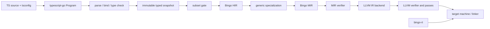

# ts2bin 项目设计

## 1. 目标与非目标

### 目标

ts2bin 将经过 TypeScript 类型检查的程序编译成可验证、可优化、可链接的 LLVM 目标代码。第一目标不是兼容所有 JavaScript 的动态行为，而是得到一个可解释、可测试、可逐步扩展的静态编译子集。

首版必须具备：

- TypeScript 语法解析和完整前端诊断复用 `typescript-go`。
- 符号、类型、重载、控制流收窄、模块依赖的稳定快照。
- 明确的 Bingo HIR 和 Bingo MIR，以及各自的 verifier。
- 基本值类型、函数、闭包、结构化对象、数组、类、模块、异常和资源清理。
- LLVM IR 输出、`VerifyModule`、优化流水线和目标文件生成。
- 编译期拒绝不可靠断言和未实现的动态语义，而不是生成“看似能跑”的错误代码。

### 非目标

以下能力不作为第一版隐式承诺：`eval`、`new Function`、`with`、任意 `Proxy`/反射改布局、运行时改变原型、完全兼容 JavaScript 抽象相等和隐式数值转换、跨模块热替换、任意 npm 原生扩展 ABI、浏览器 DOM、Node 内置模块和任意宿主 API。

## 2. 仓库与集成边界

`typescript-go` 的模块路径是 `github.com/microsoft/typescript-go`，AST/checker 位于 `internal/`，因此外部 sibling module 不能合法导入这些包。推荐结构如下：

```text
typescript-go/                         # 维护中的薄 fork
  cmd/ts2bin/                           # CLI、配置、诊断输出
  internal/ast2bingo/                   # tsgo AST + Checker -> Bingo HIR
  internal/bingo/hir/                   # 高层类型和语义 IR
  internal/bingo/mir/                   # 显式 CFG、布局、调用约定、清理
  internal/bingo/verify/                # HIR/MIR verifier
  internal/llvmbackend/                 # Bingo MIR -> go-llvm
  internal/runtimeabi/                  # runtime 函数签名与布局契约
  runtime/bingo-rt/                     # Go/C/LLVM runtime implementation
  testdata/ts2bin/                      # source、diagnostics、HIR/MIR/LLVM golden
```

适配层只依赖 `ast.Node` 的只读访问、`Program`、`Checker` 的稳定查询；不得让 Bingo 包到处 type-switch `ast.Node` 的私有实现。上游更新时只修改适配层和快照测试。

本架构的可执行细节分散在四份规格中，实施时不能只依据本文件的叙述：

| 边界 | 详细规格 | 进入下一层的门槛 |
| --- | --- | --- |
| tsgo -> snapshot | [tsgo-integration.md](tsgo-integration.md) | 诊断通过、ID 稳定、checker 已 release |
| snapshot -> HIR/MIR | [bingo-ir-spec.md](bingo-ir-spec.md) | 类型、布局、CFG 和 effect 通过 verifier |
| `.d.ts` -> runtime | [stdlib-runtime-plan.md](stdlib-runtime-plan.md) | capability manifest 有实现且 ABI hash 匹配 |
| 源码 -> 发布物 | [testing-conformance-and-release.md](testing-conformance-and-release.md) | conformance、差分、LLVM verifier、可复现构建通过 |
| 规格 -> 开发任务 | [implementation-backlog.md](implementation-backlog.md) | issue 依赖、artifact 和验收命令齐全 |

这四条边界分别解决“输入是否可信、IR 是否自洽、调用是否可链接、产物是否可发布”。任何一层失败都必须保留自己的诊断分类，不能把错误延迟到链接器或运行时。

备用方案是启动 `tsgo api` 进程并通过 JSON-RPC/MessagePack 交互，但当前 README 将 API 标为未就绪，且协议不是完整 typed AST 导出接口，只适合作为未来跨进程边界，不适合作为第一版核心依赖。

## 3. 编译流水线



每一步的输入输出都可序列化：失败时打印源位置、Bingo 节点 ID、源类型和目标 LLVM 类型。这样可以定位“TypeScript 类型正确但 lowering 错误”和“LLVM verifier 错误”两种完全不同的问题。

### 3.1 前端快照

快照是不可变的内部 DTO，而不是 `ast.Node` 指针的长期缓存。建议字段：

```text
NodeId, SourceSpan, SyntaxKind
SymbolId, ResolvedSymbolId, DeclarationId
TypeId, ContextualTypeId, NarrowedTypeId
SignatureId, SelectedOverload, TypeArguments
FlowFacts, CaptureSet, ModuleId
ConstantValue, RuntimeRepresentation, Effects
```

快照阶段要保存“类型查询结果”而不是只保存语法类型节点：`T[K]`、条件类型、映射类型和重载需要 checker 已解析的结果。若类型仍是未实例化 type parameter 或不可测量 variance，快照应标记为 unresolved，交给 subset gate 拒绝或进入动态 profile。

快照是整个编译链的并行边界：同一 checker 借用期间按文件捕获，release 后才允许 HIR lowering 并行。快照内容必须带 `typescriptGoCommit`、stdlib manifest hash、profile 和 schema version；因此它既是调试产物，也是增量缓存的输入，而不是临时日志。

### 3.2 Bingo HIR

HIR 保留 TypeScript 的语义结构，允许后续决定布局。核心对象：

```text
Module       imports, exports, init order, top-level await capability
TypeDef      nominal/structural identity, fields, methods, variance
FuncDef      params, result, generic params, effects, captures
Block        source order and structured statements
Expr         typed expression with conversion and narrowing facts
Pattern      binding/destructuring pattern
ConstValue   literal/enum/const-foldable value
```

HIR 类型分为两层：

1. `TsType`：`Any`、`Unknown`、`Never`、literal、union、intersection、conditional、mapped、type parameter、interface/class 等源语言类型。
2. `RepType`：实际值表示，如 `F64`、`I32`、`Bool`、`Utf16String`、`BigIntRef`、`ObjectRef`、`ArrayRef`、`FuncRef`、`NullableRef`、`DynamicValue`。

`TsType` 可在 HIR 中存在而不产生运行时实体；`RepType` 必须在进入 MIR 前确定。二者不可混用。

### 3.3 Bingo MIR

MIR 是 LLVM 的前一层，必须显式表示：

- 基本块、跳转、phi/SSA 值和不可达块。
- `alloc_local`、`load`、`store`、字段/元素访问、边界检查和空值检查。
- `call_direct`、`call_indirect`、闭包环境、方法 dispatch、异常 invoke。
- `convert`、`checked_cast`、`dynamic_box` 和 `dynamic_unbox`。
- `cleanup_push`、`cleanup_pop`、`defer`、异常边和函数返回边。
- `await`/`yield` 的状态机保存点。
- 模块初始化、TLS、全局变量和 runtime ABI 调用。

MIR verifier 应拒绝：未定义值、支配关系错误、phi 入边不完整、类型不匹配、错误的异常边、重复释放和未处理 cleanup。

HIR 到 MIR 的 pass 顺序固定为：类型/表示规范化 -> 显式求值顺序 -> 控制流与 phi -> 泛型实例化 -> variance adapter/checked cast -> cleanup/异常边 -> async/generator 状态机 -> runtime capability 绑定。pass 只能追加已验证事实，不能重新调用 checker 猜测源类型；完整规则见 [bingo-ir-spec.md](bingo-ir-spec.md)。

## 4. 运行时表示与 ABI

### 4.1 静态 profile（默认）

默认 profile 追求可验证和可优化，不模拟所有 JavaScript 隐式规则。

| TypeScript 类型 | Bingo 表示 | 规则 |
| --- | --- | --- |
| `boolean` | `i1` 或 ABI `i8` | 只接受布尔运算，禁止数字隐式转换 |
| `number` | `f64` | 保留 JS IEEE-754；整数 API 需显式转换 |
| `bigint` | `BigIntRef` | 由 runtime 提供任意精度；禁止与 `number` 混算 |
| `string` | `{ptr: i16*, len: usize}` | UTF-16 code unit 语义，避免把 UTF-8 当作 JS 字符串 |
| `null`/`undefined` | 独立零大小标签或 nullable bit | 两者不混同，严格空值检查 |
| `symbol` | `SymbolRef` | 身份比较交给 runtime |
| `object`/class/interface | `ObjectRef` | 已知布局优先，动态属性需显式 profile |
| `Array<T>` | `ArrayRef<T>` | 可变容器默认不变；访问可插入边界检查 |
| `ReadonlyArray<T>` | `ArrayRef<T>` 只读 view | 元素类型可协变 |
| 函数类型 | `FuncRef{code, env, signature}` | 闭包环境不可丢失 |

静态 profile 的默认运行时组合为 `gc=tracing`、显式边界检查、严格函数参数逆变和版本化 runtime ABI。`gc=arc`、`gc=arena`、`dynamic`、`Proxy` 和宿主 FFI 都必须由 profile 明确开启，并在快照、MIR 和产物 provenance 中记录。

`number` 采用 `f64` 是语义选择，不是 LLVM 默认选择；不要把所有 TS `number` 直接降成 `i32`。位运算、数组索引、移位和整数 API 必须生成明确的 `f64 -> i32/u32` 转换及溢出/截断策略。

### 4.2 dynamic profile（显式开启）

dynamic profile 提供 `DynamicValue`（tag + payload）、属性字典、原型链、JavaScript coercion 和运行时 cast。它是兼容层，不得让静态 profile 偷偷使用。所有进入 dynamic profile 的边界必须在 HIR 记录 `DynamicBoundary`，以便审计和性能统计。

### 4.3 对象与类布局

- interface、type alias、泛型约束默认只在编译期存在。
- class 产生稳定的实例布局、方法表和 class identity；`private/protected` 保留类型检查语义。
- 普通对象字面量按 shape 分配；shape 不稳定时进入 dynamic profile。
- `#private` 字段使用隐藏 slot 或 class-private descriptor，不能退化为公开字符串属性。
- `static {}` 降为类初始化函数，按模块初始化顺序执行。

## 5. TypeScript 类型语义

### 5.1 类型分层

类型检查器的 `TypeFlags` 包含 primitive、literal、union、intersection、type parameter、object、conditional、indexed access、template literal 等。Bingo 不能试图为每个 TypeScript 类型都创建 LLVM 类型：

- primitive/literal：可直接得到 `RepType`。
- union：若可由稳定 runtime tag 区分，使用 tagged union；否则必须先收窄或使用 `DynamicValue`。
- intersection：合并已知字段/接口契约；冲突布局必须通过适配器或拒绝。
- conditional/mapped/template literal type：通常是 C，先由 checker 求值，再落为具体类型；无法求值时 R/P。
- generic type parameter：在 specialization 前只保留约束和 variance，不能假设所有实例都同一 LLVM 表示。

### 5.2 协变、逆变与不变

tsgo 已实现 `Invariant/Covariant/Contravariant/Bivariant/Independent` 及 unreliable/unmeasurable 标记。Bingo 采用下面的独立规则：

| 位置 | Bingo 默认方差 |
| --- | --- |
| 函数返回值、`readonly` 字段、只读集合元素 | 协变 |
| 函数参数、`in` 类型参数 | 逆变 |
| 可写字段、可变数组元素、读写属性 | 不变 |
| 同时出现在输入和输出 | 不变 |
| 未使用的参数 | independent |
| TS 历史 method bivariance | 仅兼容模式；静态 ABI 不直接接受 |

实现要求：

1. 先使用 checker 的 assignability 和 inference 结果，保留 TypeScript 诊断兼容性。
2. 再在 Bingo 计算布局方差；如果 checker 说可赋值但 Bingo 发现可写位置不变，生成复制/适配 thunk 或报 `BINGO_INVARIANT_VIOLATION`。
3. `out T` 只能出现在协变位置，`in T` 只能出现在逆变位置；标注与实际使用冲突时拒绝。
4. 函数参数始终按 strict contravariance 生成。TypeScript 为方法回调保留的 bivariance 只允许生成带检查的适配器，不允许直接复用函数指针。
5. `Array<T>` 不照搬 TypeScript 的历史协变；`ReadonlyArray<T>`、只读 tuple 可以协变。用户若要把 `Dog[]` 当 `Animal[]` 使用，必须显式复制成 `Animal[]` 或接受 dynamic 边界。
6. variance 为 `unmeasurable` 或 `unreliable` 时，不得作为零成本泛型转换的证明；默认拒绝跨 ABI 赋值。

### 5.3 泛型策略

首选“按表示分组的单态化”：

- `number`、`boolean`、固定对象布局等实例直接生成专门版本。
- 引用类型可共享传指针版本，但必须保留字段布局和析构/写屏障信息。
- 无法统一表示的类型参数使用类型描述符 + runtime helper，不能用裸 `i8*` 冒充所有类型。
- 递归泛型、巨大实例化和无法终止的条件类型设置深度/数量上限，超限报告可定位诊断。

## 6. 语义消糖策略

消糖必须发生在有类型和控制流事实的 HIR，而不是凭 AST 形状猜测：

| 源语法 | HIR/MIR 处理 |
| --- | --- |
| `a?.b`, `a?.[k]`, `a?.()` | 保存一次 receiver，生成 nullish branch，再访问/调用 |
| `x ?? y` | 只判断 `null`/`undefined`，不使用 truthy 判断 |
| `x ||= y`, `&&=`, `??=` | 保存一次左值地址/receiver，按对应短路条件读写 |
| 解构、默认值、rest | 先生成临时值和 presence 检查，再绑定局部；有副作用的 key 只求值一次 |
| spread object/array | 静态 shape 用字段复制；动态对象调用 runtime spread helper |
| `for...of` | 选择数组快路径或 iterator protocol；`for await...of` 进入异步状态机 |
| 箭头函数 | 捕获 lexical `this`/变量，生成闭包环境 |
| 参数属性 | 构造函数入口插入字段赋值 |
| overload | 只保留一个实现体，checker 选中的签名写入调用点 |
| `as`/`satisfies`/类型谓词 | 检查后擦除；需要表示变化时转成显式 checked conversion |
| `using`/`await using` | 作用域退出边和异常边都插入 cleanup；多个资源按逆序释放 |
| `async`/`await` | Promise/Future ABI + 状态机；不把 await 当普通 call |
| generator/`yield` | 生成可恢复 frame、next/return/throw 协议；首版可 R |
| JSX | 先按 JSX factory/runtime 规则转成普通调用，再走普通 call lowering |
| `const enum` | checker 常量值可用时内联；跨模块/动态值不内联 |

## 7. 模块、异常和并发

### 模块

静态 `import`/`export` 由 Program 的模块图决定，生成模块对象、导出槽和确定的初始化拓扑。`import type`、纯类型导出擦除。循环依赖必须用“分配导出槽 -> 执行初始化”的两阶段协议，而不是简单按文件顺序调用。`import()` 需要 Promise + loader，首版建议 P/R。

### 异常

MIR 使用 `invoke`/异常边和 cleanup 栈；LLVM backend 再选择平台 personality。不能把 `throw` 编成普通返回值，也不能遗漏 `finally`。若目标平台/运行时尚未提供 zero-cost EH，先实现 runtime `setjmp` 兼容 profile，但 ABI 必须固定。

### async/await

`async` 函数返回 `Promise<T>`；状态机 frame 至少包含 program counter、活跃局部、异常状态和 cleanup 状态。await 的成功/失败都进入显式 continuation。禁止把同步函数中的 blocking 调用伪装成 await。

## 8. LLVM 后端

生产后端使用 `tinygo.org/x/go-llvm`：它能创建 module/builder、验证模块、执行 passes、创建 target machine、输出 bitcode/目标文件并提供 JIT。Go 代码通过一层 `llvmbackend` helper 访问，不在 ast2bingo 中散落 LLVM C API。

建议固定 LLVM 大版本（首版优先 LLVM 20），在 CI 中运行：

```text
go test ./...
go test -tags=llvm20 ./internal/llvmbackend/...
llvm-as generated.ll
opt -verify -passes='default<O2>' generated.ll
llc -filetype=obj generated.ll
```

Windows 开发优先使用 WSL2/Linux 或容器；TinyGo bindings 的预置 cgo 配置主要覆盖 Linux/macOS/FreeBSD，原生 Windows 需要 `byollvm` 和手动 CFLAGS/LDFLAGS。

## 9. 诊断模型

诊断分四层：

1. `TSxxx`：typescript-go 语法、绑定和语义错误。
2. `BINGOxxx`：TypeScript 合法但不在静态编译子集内。
3. `BINGO-UNSAFE`：不可靠断言、dynamic boundary、方差适配和显式不安全操作。
4. `LLVMxxx`：MIR/LLVM 类型或 verifier 错误，视为编译器 bug，不应变成用户普通诊断。

每条诊断都包含 source span、语法节点、源类型、目标表示、配置 profile 和建议修复。错误输出必须稳定，供 golden 测试锁定。

诊断生成顺序也属于接口契约：先输出 tsgo 的配置/语法/绑定/语义错误，再输出 capability 和 Bingo subset 错误；前一层有 error 时后一层不执行会产生误导的 lowering。`ts2bin doctor`、case manifest 和 release CI 必须使用同一套诊断 code 表，具体门禁见 [testing-conformance-and-release.md](testing-conformance-and-release.md)。
