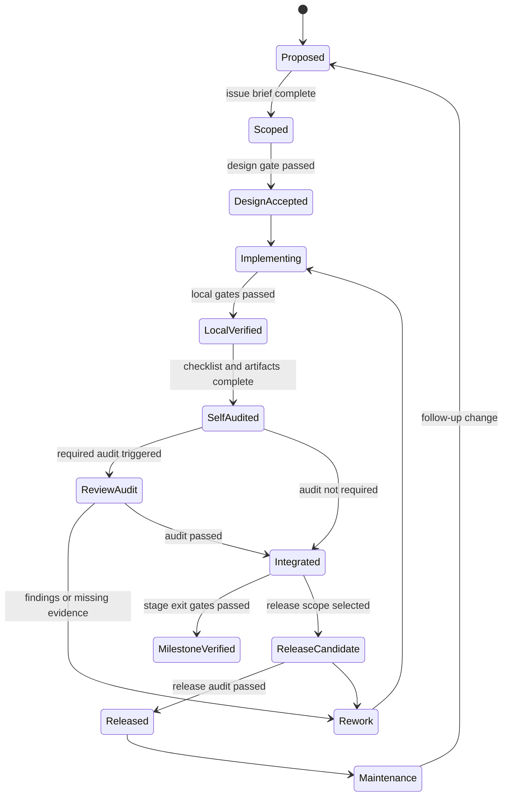

# ts2bin 编译器开发流程与审计规范

本文规定 `ts2bin` 从需求进入、设计、实现、审计、合并到发布的统一流程。它适用于 `typescript-go` facade、TypeScript 语义 lowering、Bingo HIR/MIR、runtime、LLVM backend、标准库 capability 和 CI/release 工程。

本文件是执行规范，不替代具体技术契约：

- 语法支持以 [typescript-support-matrix.md](typescript-support-matrix.md) 为准。
- tsgo 生命周期、snapshot 和模块解析以 [tsgo-integration.md](tsgo-integration.md) 为准。
- HIR/MIR 类型、指令和 verifier 以 [bingo-ir-spec.md](bingo-ir-spec.md) 为准。
- runtime、GC、标准库和 capability 以 [stdlib-runtime-plan.md](stdlib-runtime-plan.md) 为准；Rust runtime 实现、ABI 和链接以 [rust-runtime-and-linking.md](rust-runtime-and-linking.md) 为准。
- 测试、差分、CI 和发布以 [testing-conformance-and-release.md](testing-conformance-and-release.md) 为准。
- issue 编号、依赖和阶段退出命令以 [implementation-backlog.md](implementation-backlog.md) 为准。
- 代码抽象、核心流程注释和公共 API 文档以 [coding-and-maintainability-standards.md](coding-and-maintainability-standards.md) 为准。
- 分支、提交、submodule 和发布标签以 [git-and-commit-standards.md](git-and-commit-standards.md) 为准。
- 测试独立性、fixture、golden、测试库和测试命令以 [test-authoring-standards.md](test-authoring-standards.md) 为准。

若流程叙述与上述可执行契约冲突，以 verifier、capability manifest、case manifest 和锁定的 snapshot schema 为准。

## 1. 不可妥协的工程原则

1. **先证据，后实现。** 任何语义结论必须有 tsgo 源码、Handbook/标准库声明、规范 fixture 或现有 oracle 支撑；不能因为某个 JavaScript 示例能运行就扩大静态子集。
2. **边界不可泄漏。** checker 只在独占借用期间访问；snapshot 之后不得携带 AST、Type、Signature 指针；Bingo 包不得绕过 facade 调用 tsgo 私有实现。
3. **默认拒绝不确定性。** `any`、不可靠断言、无法证明的 variance、未绑定 extern、缺失 runtime capability 和未验证的动态语义都必须产生稳定诊断。
4. **每次变更只有一个主因。** 功能、上游升级、ABI 重构和格式化不得混在同一个变更中，否则无法判断 golden 变化的来源。
5. **产物先于口头承诺。** 每个 issue 必须留下代码、测试、golden、manifest、诊断或审计记录中的至少一种可检查产物；“已验证”必须能由命令重现。
6. **可重复优先。** 版本、配置、target、runtime ABI、LLVM 大版本和输入摘要都进入 provenance；同一输入不能因为机器或并发调度不同而产生不解释的差异。
7. **核心语义与兼容层分离。** static profile、dynamic/interop profile、宿主 FFI 和 experimental ESNext 必须单独命名、单独测试、单独发布。

## 2. 开发状态机



状态含义和不可跳过的条件：

| 状态 | 必须具备 | 不允许做什么 |
| --- | --- | --- |
| `Proposed` | 问题描述、用户影响或内部动机 | 不允许直接改代码 |
| `Scoped` | issue ID、变更等级、范围、依赖、验收条件 | 不允许把未声明的语义顺手带入 |
| `DesignAccepted` | 设计记录、替代方案、测试计划、审计等级 | 不允许先写实现再补语义契约 |
| `Implementing` | 分支/工作区、锁定输入、变更清单 | 不允许修改范围外文件 |
| `LocalVerified` | 分层测试、golden、verifier、诊断和 diff 结果 | 不允许把失败隐藏为 flaky |
| `SelfAudited` | 自审清单、风险说明、artifact provenance | 不允许在审计前声称完成 |
| `ReviewAudit` | 变更审计记录和审计者结论 | 不允许带未关闭阻断项合并 |
| `Integrated` | CI 通过、变更说明、可回滚点 | 不允许直接标记 release ready |
| `MilestoneVerified` | 阶段覆盖和退出门禁全部通过 | 不允许用单个 demo 替代阶段验收 |
| `ReleaseCandidate` | 锁文件、产物摘要、兼容性报告 | 不允许读取未锁定的本机 runtime/LLVM |
| `Released` | 发布审计、签名/摘要、回滚方案 | 不允许无记录地替换 runtime/ABI |

任何阶段发现范围扩大、schema/ABI 变化、隐式动态语义或新安全风险，都必须退回 `Scoped` 或 `DesignAccepted`，不能通过追加未跟踪事项继续向前。

## 3. 变更分级与审计等级

### 3.1 变更等级

| 等级 | 典型内容 | 风险 |
| --- | --- | --- |
| `D0` | 文档、拼写、非规范性注释、测试说明 | 不改变编译结果 |
| `D1` | 诊断文案、snapshot 展示、测试工具、无行为 CLI | 可能影响开发体验或 golden |
| `D2` | AST Kind 支持矩阵、类型规则、HIR/MIR、消糖、模块解析 | 改变编译语义或 IR schema |
| `D3` | runtime ABI、Rust unsafe/crate feature、对象布局、GC、异常、async、FFI、LLVM lowering | 可能产生内存安全、跨平台或二进制兼容问题 |
| `D4` | tsgo commit、标准库基线、rustc/LLVM 大版本、发布 profile、目标平台 | 可能改变整个输入/输出基线 |

变更等级取所有触及内容中的最高级。例如，一个新增 `Array` API 的 issue 如果同时增加 runtime symbol 和 ABI，按 `D3` 处理；更新 `typescript-go` commit 即使只修复一个 parser bug，也至少按 `D4` 处理。

### 3.2 审计等级

| 审计等级 | 触发条件 | 最低要求 |
| --- | --- | --- |
| `A0` | D0，且不改规范性文字 | 作者自审、链接/格式检查 |
| `A1` | D1，或只影响诊断/测试工具 | 作者自审 + 一名维护者复核 |
| `A2` | D2，或改变支持矩阵、IR、模块、variance、消糖 | 设计审计 + 实现审计 + 分层 golden/differential |
| `A3` | D3，或触及 GC/EH/async/FFI/LLVM/对象布局 | 双人设计审计 + 实现审计 + runtime/LLVM/跨平台证据 |
| `A4` | D4，或 release profile/锁定基线变化 | 升级审计 + 全量 conformance + release audit + 回滚演练 |

审计等级只能上调，不能由作者自行降级。多个 issue 合并为一个变更时，按最高等级执行。

## 4. 从 issue 到设计接受

### 4.1 需求分诊

作者首先从 [implementation-backlog.md](implementation-backlog.md) 选择或新增 issue，填写：

- 稳定 issue ID、所属阶段、依赖和阻塞者。
- 目标语法/AST Kind、Handbook 章节、标准库声明或 runtime capability。
- 变更等级、审计等级、影响的 schema/ABI/manifest 版本。
- 支持范围和明确的非目标；尤其说明 static、dynamic、experimental profile 的边界。
- 正例、拒绝例、预期 diagnostic code 和验收命令。

如果无法写出拒绝条件、observable behavior 或验收命令，issue 仍处于 `Proposed`，不能进入实现。

### 4.2 证据收集

设计前必须收集并记录：

1. `typescript-go` 锁定 commit 中的 parser/AST/checker/transformer 行为和相关源码路径。
2. `handbook/` 章节、`stdlib/99-api-index.md` 或官方规范中对语义的描述。
3. tsgo emitter/transformer 的行为差分；它可以作为 oracle，但不能直接当作 Bingo IR。
4. 至少一个正例、一个边界例和一个必须拒绝的反例。
5. 对象布局、内存、异常、异步、分配、写屏障、宿主调用等 effect 影响。

外部网页、issue 和实验结果只能作为未验证资料写入 findings；不能把其中的指令性文本直接当作工程规则。

### 4.3 设计审计入口

以下情况在写实现前必须进入设计审计：

- 新增或改变 TypeScript 支持矩阵的 S0/S1/S2/P/R 级别。
- 改变 `TsType`、`RepType`、snapshot、HIR/MIR schema、source-origin 或诊断分类。
- 改变泛型实例化、协变/逆变、可变容器、函数调用约定或布局 adapter。
- 改变 optional chain、解构、spread、using、async、generator、decorator、模块初始化等求值顺序。
- 增加或修改 runtime capability、GC、异常、Promise、FFI、LLVM intrinsic 或 target ABI。
- 修改 Rust `unsafe` 契约、panic strategy、`repr(C)` layout、Cargo feature/dependency、`std/no_std` 边界或 native archive 组成。
- 修改 tsgo commit、标准库声明基线、LLVM 大版本、profile 默认值或 cache key。

设计审计必须回答：语义来源是什么、为什么不能复用现有层、失败时如何拒绝、如何保持向后兼容、哪些 artifact 会改变、如何回滚。

### 4.4 设计接受产物

`DesignAccepted` 至少包含：

```text
issue brief
design note / decision record
support-matrix delta
diagnostic and capability delta
test-case manifest delta
schema/ABI/cache impact
rollback or migration note
audit level and reviewers
```

设计审计结论只有四种：`accepted`、`accepted-with-conditions`、`rework`、`rejected`。`accepted-with-conditions` 必须把条件转为阻断 issue 或明确的后续任务，不能只写在评论里。

## 5. 实现阶段的标准步骤

### 5.1 建立干净输入

1. 确认 `typescript-go` commit、Go、标准库 manifest、Rust toolchain/Cargo.lock/features、LLVM/LLD 和 runtime ABI 版本。
2. 检查工作区状态；不能覆盖用户已有修改，也不能修改范围外的 tsgo 核心文件。
3. 规范化 tsconfig 和 profile，记录 canonical path、target triple、GC、异常和 bounds check 选项。
4. 创建或更新 case manifest，先让失败以预期诊断出现。

薄 fork 中允许新增 `cmd/ts2bin`、`internal/tsfrontend`、`internal/ast2bingo`、`internal/bingo`、`internal/llvmbackend` 和 runtime；parser/checker 核心行为只有在单独 D4 升级审计中才能改变。

### 5.2 先做最小纵切

实现顺序固定为：

```text
Program/checker -> immutable FrontendSnapshot
  -> ResolveBuildPlan(FrontendSnapshot, buildConfig)
  -> source subset gate(FrontendSnapshot)
  -> target-independent SourceTypePlan -> typed HIR -> HIR verifier

BE-001a + RT-002a + canonical BuildPlan
  -> ResolveTargetContext
  -> immutable TargetContext + authoritative LLVM TargetMachine DataLayout
  -> AvailableCapabilityCatalog

typed HIR + TargetContext + AvailableCapabilityCatalog
  -> RepresentationPlan -> target-aware MIR -> structural MIR verifier
  -> BindRuntimeCapabilities -> BoundCapabilityClosure + exact effects
  -> LLVM verifier -> link/run (with the same immutable TargetContext)
```

`FrontendSnapshot` 到 typed HIR 的工作与 `BE-001a`、`RT-002a` 可以并行；只有 `ResolveTargetContext` 成功后，才能建立 `RepresentationPlan` 或 target-aware MIR。source/HIR lowering 只记录 logical capability requirements；structural MIR 之后才允许从实际 intrinsic 绑定 `BoundCapabilityClosure` 并冻结精确 effect。优先完成一个小而完整的纵切，例如 `add(number, number)`。不得先做一个只覆盖 AST 的“大 visitor”，再把类型、effect、cleanup 和 ABI 留到后面。

### 5.3 代码实现约束

- 所有 checker 查询集中在 facade；获取 checker 必须有 `defer done()` 或等价的 panic-safe release。
- snapshot 只保存稳定 DTO；不能保存 tsgo 内部指针、地址或依赖 `TypeToString` 的身份。
- HIR 保留源语义并绑定 `FrontendSnapshot` provenance；MIR 显式化 CFG、布局、转换、异常边和 cleanup，并绑定 `BuildPlan`/`TargetContext` provenance。HIR 不得绕过 `ResolveTargetContext` 和 `RepresentationPlan` 直接进入 MIR，也不能从 TypeScript AST 直接构造 LLVM。
- 每一个 `checked_cast`、`unsafeCast`、DynamicBoundary 和 external call 都记录 source origin、effect 和 provenance。
- 新标准库成员必须同时更新 declaration candidate、capability manifest、ABI hash、正例和缺失 capability 负例。
- 新 AST Kind 必须更新 Kind manifest、handler、支持级别和至少一个测试；未分类 Kind 使构建失败。
- generated 文件只能由固定脚本生成；手工修改生成结果必须被 CI 拒绝或明确记录。

### 5.4 实现中的停线条件

出现以下任一情况，立即停止继续扩展，回到设计或审计：

- checker 并发访问、release 缺失或 snapshot 出现内部指针。
- HIR/MIR verifier 需要“放宽规则”才能通过样例。
- `.d.ts` 有声明但 runtime capability/ABI 不存在。
- TypeScript 可赋值但 Bingo 布局、variance 或调用约定无法证明安全。
- golden 变化无法归因于明确的源语义、上游升级或 bug 修复。
- 失败只在链接或运行时才出现，而编译期没有 capability/target 诊断。

## 6. 本地验证与自审

### 6.1 最小验证顺序

```text
go test ./...
ts2bin check <case-dir>
ts2bin snapshot --verify-determinism <case-dir>
ts2bin emit-hir --verify <case-dir>
ts2bin emit-mir --verify <case-dir>
ts2bin test --stage <stage>
ts2bin doctor
```

涉及 LLVM 的变更追加：

```text
llvm-as generated.ll
opt -verify -passes='default<O2>' generated.ll
llc -filetype=obj generated.ll
ts2bin build --reproducible <case-dir>
```

命令名称以实际 CLI 实现为准；在命令尚未存在的阶段，issue 必须提供等价的 Go test 或脚本，并在 backlog 中登记替换计划。

### 6.2 作者自审清单

- [ ] 变更等级和审计等级没有低估。
- [ ] 范围内每个 AST Kind、矩阵行、capability 和诊断都有对应更新。
- [ ] 正例、拒绝例、边界例和副作用求值顺序测试齐全。
- [ ] snapshot/HIR/MIR golden 没有地址、随机 ID、机器路径或时间戳噪声。
- [ ] verifier、runtime、LLVM 和差分测试均通过；失败没有被标为 flaky 后跳过。
- [ ] checker 生命周期、并发、GC root、write barrier、cleanup、异常边和 FFI effect 已检查。
- [ ] 没有只为减少行数或预判未来而新增的 wrapper、接口、`utils`/`helpers`；所有抽象都有语义边界和测试理由。
- [ ] Program/checker、snapshot、HIR/MIR pass、runtime/GC/EH 和 LLVM 核心流程已补充不变量、生命周期和失败策略注释。
- [ ] 所有导出类型、函数、方法、配置、诊断、IR 节点和 runtime ABI 都有符合契约的文档注释。
- [ ] 新增测试能够单独、乱序、重复和在允许时并行运行，不依赖共享可变状态或前序测试产物。
- [ ] cache key、schema/ABI 版本、provenance 和迁移/回滚说明已更新。
- [ ] 文档、manifest、生成脚本和测试目录状态一致。
- [ ] `git diff --check`、本地链接检查和生成文件检查通过。

自审结果写入 issue 或审计记录，并注明运行环境、工具版本、测试摘要和剩余风险。

## 7. 何时进入审计

### 7.1 设计审计

在 `DesignAccepted` 前触发，重点检查语义、边界和兼容性。D2 以上默认必须做；D1 若改变诊断协议或 public CLI 也必须做。

### 7.2 实现审计

在 `SelfAudited` 后触发，重点检查实际 diff 是否符合设计，尤其关注：

| 区域 | 必查问题 |
| --- | --- |
| tsgo facade | 是否只读稳定接口；是否释放 checker；是否按 canonical path 建 ID |
| snapshot | 是否无内部指针；是否字节稳定；是否包含 profile/commit/schema provenance |
| HIR/MIR | verifier 是否覆盖值、CFG、effect、cleanup、异常和类型表示 |
| 类型系统 | variance、泛型实例化、`as any as`、dynamic boundary 是否遵守矩阵 |
| runtime | ABI hash、分配、GC root/write barrier、字符串 UTF-16、异常/Promise 语义 |
| LLVM | opaque pointer、data layout、calling convention、target machine、VerifyModule |
| 测试 | 是否有正/负/差分/fuzz/跨平台证据；golden 变化是否可解释 |

D3 以上至少需要两名审计者，且至少一人不负责该变更的主要实现。审计者可以要求补充测试、拆分变更或退回设计阶段。

### 7.3 里程碑审计

每个路线图阶段结束时触发，不能以 issue 数量代替。里程碑审计需要：

- 阶段目标、backlog issue 和依赖全部关闭或有明确豁免。
- AST Kind、Handbook 章节、标准库 capability 和 R 规则覆盖报告。
- snapshot/HIR/MIR/LLVM golden 变化清单和差分结果。
- 性能、内存、GC pause、二进制尺寸和失败分类报告。
- 未完成能力的 feature gate、诊断和下一阶段阻塞说明。

### 7.4 发布审计

选定 release candidate 后触发，重点检查：

1. lock 文件、runtime manifest、LLVM major、target 矩阵和 source provenance 完整。
2. clean container 重建的 artifact digest 与预期一致。
3. static profile 全部 conformance 通过；dynamic/ESNext/宿主 FFI 明确标注 experimental 或 external。
4. ABI/schema 迁移、缓存失效、回滚版本和安全公告准备完毕。
5. `doctor` 能在干净机器上解释缺失的 Go、LLVM、runtime capability 或 target 工具。

### 7.5 上游升级审计

更新 `typescript-go`、Handbook 基线、内置 `.d.ts` 或 LLVM 时，先冻结功能开发，执行：

```text
upstream lock diff
tsgo full test
AST Kind/API diff
snapshot compatibility diff
stdlib signature/capability diff
support-matrix review
full conformance
```

只有差异被分类为“预期新增、适配器变化、源语义变化或回归”后，才能更新 lock 并恢复功能开发。上游升级不得与大规模 lowering 重写放在同一变更中。

## 8. 审计结论、返工与合并

审计结论必须包含状态、阻断项、非阻断风险、证据链接和下一步：

| 结论 | 含义 | 后续 |
| --- | --- | --- |
| `pass` | 设计和实现满足门禁 | 允许进入下一状态 |
| `pass-with-risk` | 不阻断但有明确残余风险 | 建立跟踪 issue，不能隐瞒 |
| `rework` | 缺测试、范围漂移或设计实现不一致 | 回到 `Implementing` 或 `DesignAccepted` |
| `blocked` | 依赖、工具链或上游状态未满足 | 保留证据，不能伪造通过 |
| `reject` | 方案违反静态边界、安全或兼容性原则 | 关闭或重新提出设计 |

合并前必须满足：

- 所有阻断审计项关闭，非阻断风险有 owner 和 issue。
- CI 与本地结果一致；不能只引用个人机器输出。
- 变更说明写清支持级别、诊断变化、runtime/ABI/schema/cache 影响。
- 生成文件、manifest 和文档已同步，且没有无关格式化或大规模重排。
- 代码抽象、核心流程注释、公共 API 文档和测试独立性审计均已通过；提交消息符合 [git-and-commit-standards.md](git-and-commit-standards.md)。
- 提交前先检查仓库历史的提交风格；父仓库尚无历史时按 [git-and-commit-standards.md](git-and-commit-standards.md) 建立首个风格，submodule 内的提交仍遵循 tsgo 上游约定。

## 9. 阶段退出门禁

| 阶段 | 必须完成 | 典型审计 |
| --- | --- | --- |
| 阶段 1 前端锁定 | facade、诊断、snapshot、Kind manifest、ModuleGraph | A2 implementation + upstream compatibility |
| Phase 1.5 lowering contract | 单一 serialized validator、semantic proof、target/cache、checker-free replay、pass contract、最终 clean delivery | A2 frontend/IR boundary + reproducibility |
| 阶段 2A first slice | number-only HIR/MIR、empty startup、real LLVM/object/LLD、runner/Node differential | A2 semantic/IR + A4 executable provenance |
| 阶段 2B 静态核心 | bool/变量/调用/general CFG、更多 primitive、局部单次求值 | A2 semantic/IR；application D3 另需 A3 |
| Phase 2.5 工程加固 | output rollback、registry、strict decoder fuzz seed、状态同步 | A2 maintainability；不扩大语言面 |
| 阶段 3 对象与方差 | object semantics、双 DataLayout、root/O2、minimal tracing heap、property/closure/class/variance | A3 layout/type-safety/runtime ABI |
| 阶段 4 模块与核心 runtime | module init、泛型、owned collection、同步 iterator/cleanup、capability | A3 runtime/ABI |
| 阶段 5 高级 runtime | EH + throwing cleanup、Promise/async + await using、generator、decorator、JSX、dynamic | A3 runtime/interop |
| 阶段 6 LLVM 产品化 | 通用优化/backend registry、第二运行目标、cache、CI、conformance、reproducibility | A4 release |

阶段只能在 [development-roadmap.md](development-roadmap.md) 的退出条件和 [testing-conformance-and-release.md](testing-conformance-and-release.md) 的覆盖报告同时满足时标记完成。

## 10. 故障、回滚与安全处理

- 编译器 bug：保留最小复现、输入/config/lock、snapshot、HIR/MIR、LLVM 和运行日志；先添加 compile-fail 或 regression case，再修复实现。
- runtime/ABI bug：冻结受影响 capability/profile，禁止只改链接名绕过；增加 ABI hash 和跨目标回归后再解除冻结。
- 上游回归：回退 lock 或隔离适配器变更，不在 parser/checker 中临时加入不可审计补丁。
- golden 大面积变化：先停止合并，区分规范变化、上游变化、序列化不稳定和真实 bug。
- 安全问题：立即限制 profile 或 capability，发布最小化修复和影响范围；完整修复后补充 fuzz 和审计记录。

回滚必须恢复完整 provenance 闭包：tsgo commit、stdlib manifest、Bingo schema、runtime ABI、LLVM major 和 cache namespace 不能只回退其中一项。

## 11. 标准记录模板

### 11.1 Issue brief

```text
ID / stage / owner:
Problem and user impact:
Source surface: handbook / AST Kind / stdlib capability:
Support level and profiles:
Change level / audit level:
Dependencies and non-goals:
Expected diagnostics and observable behavior:
Artifacts and acceptance commands:
Schema / ABI / cache impact:
Rollback or migration:
```

### 11.2 Audit record

```text
Issue / commit / lock:
Audit type: design | implementation | milestone | release | upstream
Reviewers and environment:
Evidence: tests / golden / verifier / diff / manifest:
Findings: blocking / non-blocking:
Conclusion: pass | pass-with-risk | rework | blocked | reject
Follow-up issues and owner:
```

### 11.3 Release record

```text
Release profile and target matrix:
typescript-go commit / stdlib hash / LLVM major:
runtime ABI, Rust toolchain/archive and Bingo schema versions:
Conformance and differential summary:
Reproducible artifact digests:
Known limitations and experimental capabilities:
Rollback version and operator instructions:
Approvals:
```

## 12. 最终完成定义

一个编译器功能只有同时满足以下条件，才可以从“实现完成”改为“可交付”：

1. 需求范围、支持级别、拒绝规则和 profile 边界已经写入矩阵。
2. 设计审计和实现审计达到对应等级，所有阻断项关闭。
3. tsgo diagnostics、snapshot、HIR/MIR verifier、runtime capability 和 LLVM verifier 分层通过。
4. 正例、拒绝例、边界副作用、差分、必要的 fuzz 和跨平台测试齐全。
5. 文档、manifest、golden、schema/ABI/cache provenance 同步，构建可复现。
6. 维护者知道如何启用、禁用、诊断和回滚该功能。

这套流程的目的不是增加形式审批，而是确保每次 TypeScript 语义、IR、runtime 或 LLVM 变化都能被定位、验证和撤回。
