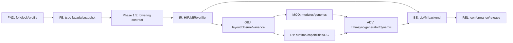

# ts2bin 可执行实施 Backlog

本文把六阶段路线图转换为可直接创建 issue 的工作分解。编号一旦进入实现就保持稳定；拆分子任务时追加后缀，例如 `FE-003a`，不要复用已关闭编号。2026-08-05 方向审计新增的 Phase 1.5 契约 issue 必须先于任何 IR 扩展实现。

issue 从提出到发布的状态、变更分级、审计入口和记录模板统一遵守 [compiler-development-process.md](compiler-development-process.md)。本文件回答“做什么、依赖谁”，流程文档回答“按什么步骤做、何时必须停下来审计”。

## 1. Issue 完成契约

每个 issue 至少包含：

- 关联的 TypeScript 支持矩阵行、handbook 章节和 AST Kind group。
- 输入 schema、输出 artifact、BINGO 诊断 code、runtime capability 和 ABI/schema 版本影响。
- 正例、拒绝例、snapshot/HIR/MIR golden；产生目标代码时再增加 LLVM verifier 和运行结果。
- 明确验收命令。命令尚未实现时由该 issue 同时补齐，不能只写“手工验证”。
- 上游 tsgo 行为、Bingo 静态规则和 dynamic/FFI 边界有冲突时，记录决策而不是隐式兼容。

统一完成定义：测试通过、无未分类 AST Kind、无 checker 指针越过 snapshot 边界、verifier 通过、capability 闭包完整、文档和 manifest 同步。

状态必须使用以下含义，禁止用“代码已写”代替验收完成：

| 状态 | 含义 |
| --- | --- |
| `implemented` | 主要生产代码已经存在，至少有定向正例；不代表阶段门禁已通过 |
| `prototype` | 只证明受限 happy path，schema、依赖边界或负例仍不完整 |
| `acceptance-blocked` | 实现已存在，但指定 regression、独立进程/clean clone、生产集成或负例证据仍失败/未运行 |
| `ready` | 所有前置门禁已关闭，可以开始实现，但本 issue/阶段尚未达到退出条件 |
| `complete` | issue 的正例、拒绝例、独立边界、全套验收命令和交付 provenance 全部通过 |

## 2. 依赖主链



LLVM backend 可以较早用 primitive MIR 做纵向验证，但发布路径必须等 runtime ABI、异常/清理和 capability 闭包稳定后再冻结。

## 3. Foundation 与前端

| ID | 结果 | 依赖 | 主要验收 |
| --- | --- | --- | --- |
| `FND-001` | 建立薄 fork、`cmd/ts2bin` 和 `ts2bin.lock.json` | 无 | tsgo 上游测试通过；锁文件打印 commit/Go/stdlib/LLVM 版本 |
| `FND-002` | 规范化 `bingoOptions`、static/dynamic/interop profile | FND-001 | 配置 digest 稳定；不兼容选项有配置诊断 |
| `FND-003` | 建立诊断 code registry 与稳定排序 | FND-001 | TS/BINGO/BINGO-UNSAFE/LLVM 分类 golden |
| `FND-004` | 建立可获取的 ts2bin pinned-fork 交付与 clean-clone 门禁 | FND-001 | `.gitmodules`/lock/gitlink 固定 `pqcqaq/typescript-go` fork commit及 reviewed upstream ancestor；doctor 验证 remote/clean worktree/ancestry/closure；remote fork fetch 后通过测试/vet |
| `FE-001` | 封装 tsconfig -> CompilerHost -> Program 构造链 | FND-001 | `ts2bin check` 与 tsgo 诊断一致 |
| `FE-002` | 实现 checker 独占借用 helper 与 panic-safe release | FE-001 | 并发/提前返回测试无死锁；race test 通过 |
| `FE-003` | 定义并生成 `ProgramSnapshot`/稳定 ID | FE-002 | snapshot 无 AST/checker/type 指针；重复构建字节一致 |
| `FE-004` | 捕获 Type/Signature/Symbol/overload/narrowing facts | FE-003 | handbook 类型系统 fixture 的 semantic digest 稳定 |
| `FE-005` | 生成 AST Kind support manifest 与 subset gate | FE-003, FND-003 | 所有 source Kind 均为 S0/S1/S2/C/P/R 且有 handler/test |
| `FE-006` | 使用 Program resolution 生成 ModuleGraph | FE-003 | ESM/CJS/Node resolution、canonical path、循环依赖 golden |
| `FE-007` | 上游升级审计与 snapshot compatibility runner | FE-004, FE-005 | tsgo commit 变化会输出 Kind/API/stdlib/semantic diff |

阶段退出命令目标：

```text
go test ./internal/tsfrontend/...
ts2bin check testdata/ts2bin/syntax
ts2bin snapshot --verify-determinism testdata/ts2bin/frontend
ts2bin test --stage frontend
```

## 3.1 Phase 1.5：frontend-to-lowering contract

这些 issue 是进入 `IR-001` 的 P0 前置门禁；Phase 1 原有 `FE-001..007` 即使通过，也不能跳过本节。

| ID | 结果 | 依赖 | 主要验收 |
| --- | --- | --- | --- |
| `FE-008` | Snapshot schema v2、fail-closed capture 和完整性验证 | FE-003, FE-005 | tagged `SyntaxPayload`、具名 child roles、source blob、可解码 type payload；checker helper panic/error 不得降为空事实；reference/digest/parent-root/acyclic validation negative tests |
| `FE-009` | Property/signature/assertion/flow/capture/module semantic proof closure | FE-004, FE-006, FE-008 | read/write/optional/readonly/accessor/private、optional/rest/effects、assertion chain/representation、non-null proof kind、runtime free variables、specifier-level type-only edge golden |
| `FE-010` | AST/checker release 后的 snapshot-only first-slice replay 与 readiness hardening | FE-008, FE-009, FE-011 | 在稳定的 frontend/build-plan 边界上，`add(number, number)` 只消费序列化 snapshot 生成 canonical lowering events/verified HIR；fresh serialization/order determinism；未绑定 Kind、多 return、非 number、坏 symbol/type fail closed |
| `FE-011` | Platform identity、semantic-option closure、target split、profile merge 和 cache provenance | FE-008, FE-009 | case-sensitive path、Windows/WSL、完整 TS semantic options、target-independent frontend hash、CLI profile override 和 cache invalidation tests |
| `IR-000` | SourceTypePlan -> typed HIR -> specialization fixed point；BuildPlan -> ResolveTargetContext；二者经 RepresentationPlan -> MIR CFG/SSA -> verifier 的唯一 pass/effect DAG | FE-009, FE-010, FE-011 | 文档/实现/IR golden 使用同一顺序；循环实例化、effect 和 malformed pass 输入可验证 |

### 3.2 当前审计状态（2026-08-06）

| ID | 状态 | 已验证结果 / 剩余工作 |
| --- | --- | --- |
| `FND-004` | `complete` | 交付机制已迁移为 `pqcqaq/typescript-go` 固定 fork commit，旧 patch/materialize/apply 路径已退役；本地 doctor、frontend 九阶段、隔离 fork smoke/full test/vet、locked replay 双构建、远端 fork fetch/full test/vet 与 committed parent HEAD clean-clone 均已通过。 |
| `FE-008` | `complete` | schema v2、Kind-driven payload/role/arity、fail-closed graph/hash validation 和 overlay 负例均已进入 wire 单一 validator；`tsfrontend` 仅保留委托 API，核心/race/full regression 通过。 |
| `FE-009` | `complete` | property/signature/assertion/non-null/flow/capture、per-specifier bindings、effect closure、lowerer facts 和 ownership/redirect 负例已闭合；capture 只产出 proof，wire 独立重算并通过序列化 round-trip。 |
| `FE-010` | `complete` | checker-free `frontendwire`/`ast2bingo`/replay process、dependency closure、重复输出、显式 evaluation-order/single-block HIR 和 tamper post-verifier 已通过；compatibility/snapshot/options migration baseline 已审查并全绿。 |
| `FE-011` | `complete` | target-independent capture、semantic options、Windows/WSL identity、跨盘/UNC/POSIX rooted path fail-closed、profile/cache regression和 validated FrontendSnapshot binding 已通过；BuildPlan 已明确为 canonical unresolved request，默认 no-EH provenance 已迁移。 |
| `IR-000` | `complete` | canonical executor、specialization budget/fixed point、pre/post verifier、effect proof、deterministic replay/dump/golden，以及 validate-snapshot -> typed-HIR production prefix 已通过核心、race、frontend stage 与全仓 regression。typed HIR 之后的 TargetContext、生产 handlers 与真正 MIR verifier明确属于 Phase 2A。 |
| `FE-012a` | `complete` | capture-core validation/diagnostic sealing 已分层；subset gate 自行验证并使用 detached snapshot，production lowering 对重哈希 flags/modifiers/type-closure 篡改在三种 wrapper 路径全部 fail closed。 |
| `IR-007a` | `complete` | first-slice number contract v1 显式冻结 binary64、canonical qNaN、`-0`、RNE/no-fast-math `+`、固定 C ABI 与 bit observation；替代 policy 全部拒绝。 |
| `IR-001a/002a/003a` | `complete` | HIR major 2、CompilerBuildIdentity、identity-free source plan、logical requirements、number-only canonical HIR 与完整 malformed verifier matrix 已闭合；不同 driver identity 生成不同 HIR provenance/hash。 |
| Typed artifact envelope substrate | `complete` | role/schema/payload digest、canonical envelope、不可变 transition 和 typed read/write metadata 已实现；resolver 只读取 BuildPlan/runtime/toolchain manifests，HIR 保留到 RepresentationPlan join。 |
| `BE-001a` | `complete` | Go-LLVM wrapper 已锁定 Linux x86-64、LLVM 20.1.8、generic CPU 与 TargetMachine authoritative DataLayout；独立 module verifier 与重复 deterministic ELF object emission 通过。 |
| `RT-002a` | `complete` | Rust 1.97.1 workspace、版本化 ABI schema、empty startup、唯一 umbrella staticlib 与 runtime manifest 已落盘；Cargo test/fmt/clippy、Clang/LLD smoke 和隔离重复构建 byte identity 通过。 |
| `TC-001a` | `complete` | strict resolver 以真实 TargetMachine 交叉校验 BuildPlan/toolchain/runtime manifests，输出 immutable TargetContext、authoritative DataLayout 与非空 AvailableCapabilityCatalog；opaque HIR sidecar 原样保留，tamper/substitution 全部 fail closed。 |
| `RT-002b` | `complete` | ABI schema 固定程序导出 `extern "C" double add(double,double)`；严格 16 位 binary64 hex harness、harness object identity 和 runtime manifest/lock 已由重复 WSL 构建验证。 |
| `BE-002a` | `complete` | final verified bound MIR 真实降为 LLVM `fadd`/`nounwind`，通过 VerifyModule 与 deterministic ELF object emission；LLVM/object bytes 与全部 target/MIR provenance 进入 emission identity。 |
| `BE-004a` | `complete` | strict runtime inputs 经大小/SHA-256 复验后用 path-free deterministic response file 调用锁定 Clang/LLD；重复 link 的 response/map/executable identity 稳定，map 证明唯一 umbrella archive 与 ABI symbol，bit harness 已真实运行。 |
| `REL-001a`, `VERT-001` | `complete` | `test --stage static-core` 固定运行 checked-in first-slice manifest，在单 case timeout 内执行 snapshot-only HIR/MIR、LLVM/object/LLD/process；canonical report 绑定 compiler identity 与全部 artifact/output hashes，两组 binary64 vectors 通过。 |

`FE-008a/009a/010a/011a/011b/012a`、`IR-000a/007a/001a/002a/003a/004a/005a/008a`、`FND-004a`、`BE-001a/002a/004a`、`RT-002a/002b`、`TC-001a`、`REL-001a` 与 `VERT-001` 的实现及交付验收均已关闭；当前只剩 `REL-002a` Node oracle differential。该差分通过后才进入控制流和广泛语法的 Phase 2B。

| 子任务 | 必须交付的关闭证据 |
| --- | --- |
| `FND-004a` | 已关闭：lock/gitlink/checkout 固定同一 fork commit，reviewed upstream 是其祖先，doctor 与远端 fork fetch/full test/vet 通过，包含正确 `.gitmodules`/lock/gitlink/scripts 的 committed parent HEAD clean clone 也确认身份、clean worktree 与 doctor。 |
| `FE-008a` | `frontendwire.ValidateProgramSnapshot` 成为 serialized validation 单一真源，`tsfrontend` 最终验证委托给它；原 overlay 反例必须作为 checked-in negative tests 通过，Kind/KindValue 漂移 fail closed。 |
| `FE-009a` | 保留已实现的 free/instance/static/constructor ownership/redirect negative tests；让 checker-time AST analyzer 只产出 proof，由 wire 单一 validator 独立重算 effect closure、module binding 与 lowerer required facts；禁止复制 serialized effect helpers。 |
| `FE-011a` | 对 source-level target independence、三项 TS options、validated FrontendSnapshot/BuildPlan binding、Windows/WSL path/profile/cache 运行全套 regression；跨盘符、UNC、POSIX rooted option/file/module/diagnostic path 在 wire 边界 fail closed。 |
| `FE-011b` | 增加 canonical no-EH first-slice mode，迁移 default options、lock、BuildPlan 与 golden；未实现的 `llvm-eh` 不得作为默认或已支持 provenance，status-code/native-unwind 后续分别锁定。 |
| `FE-010a` | 已有 dependency closure、新进程磁盘 replay、显式 primitive evaluation-order/single-block HIR 和重复输出证据；关闭 wire migration 后的 compatibility/snapshot/options full regression。 |
| `IR-000a` | canonical executor、specialization budget/fixed-point failure、pre/post verifier、independent effect proof、deterministic dump/golden 与 validate-snapshot -> typed-HIR production prefix 的定向及全量 regression 通过；后续 handler 集成属于 Phase 2A。 |

## 4. Bingo IR 与静态核心

| ID | 结果 | 依赖 | 主要验收 |
| --- | --- | --- | --- |
| `IR-001` | 在已冻结 HIR v2 基础上扩展完整 TsType/RepType/entity/origin schema | IR-000, FE-009, FE-010 | schema round-trip、版本拒绝、snapshot-only input 和 canonical hash 测试 |
| `IR-002` | HIR module/function/block/expression builder | IR-001, FE-005 | literal、变量、函数、if/loop/switch HIR golden |
| `IR-003` | HIR verifier 与 effect/unsafe provenance | IR-002 | 人工 malformed HIR 全部被拒绝 |
| `IR-004` | HIR -> MIR 的 CFG/SSA/phi/内存指令 lowering | IR-003 | 支配关系、phi、load/store、terminator golden |
| `IR-005` | MIR verifier 与 runtime intrinsic signature 检查 | IR-004 | malformed MIR 不进入 backend；capability 未绑定时失败 |
| `IR-006` | 可选链/nullish/逻辑赋值/解构等单次求值消糖 | IR-002 | getter/computed key/call 次数与 Node oracle 一致 |
| `IR-007` | primitive 表示、conversion、operator table | IR-004 | f64/NaN/-0、bool、null/undefined、UTF-16 fixture |
| `IR-008` | HIR/MIR 文本与二进制序列化、diff 工具 | IR-003, IR-005 | golden 可读、schema mismatch 明确、无地址噪声 |

### 4.1 Phase 2A first-slice 子任务

完整 `IR-001..007` 的验收包含变量、调用、general CFG、phi/memory、bool/null/string，不能作为 number-only 纵切的前置。Phase 2A 只关闭以下窄子任务；完整 issue 在 Phase 2B 及以后继续：

| ID | 依赖 | first-slice 关闭证据 |
| --- | --- | --- |
| `FE-012a` | FE-008a, FE-010a | 拆分 capture-core validation 与最终 diagnostic sealing；`RunSubsetGate` 只消费 validated snapshot/token 或自行 fail closed 验证，malformed snapshot 不能产生可被后续阶段信任的 subset 结果 |
| `IR-007a` | IR-000a | 在 RepType schema 前冻结 JavaScript `number = f64`、NaN payload policy、`-0`、`+` operator 和 C ABI bit-observation contract；不提前接受其他 primitive representation |
| `IR-001a` | IR-000a, IR-007a, FE-009a, FE-010a, FE-011b, FE-012a | 将已新增 mandatory provenance 的 pre-release HIR v1 协调升为 schema major 2，冻结只允许 number/void 的 TsType/RepType/entity/origin schema；同步 `HIRSchemaVersion`、replay、lock 与 IR-008 migration/rejection tests，并加入 upstream/fork/lowering `CompilerBuildIdentity`；bool/string/null/undefined fail closed |
| `IR-002a` | IR-001a | validated serialized snapshot 只生成参数读取、number 加法、单 block return 的 canonical HIR；artifact/op 显式携带 canonical logical capability requirements，纯 add 允许空 requirements |
| `IR-003a` | IR-002a | HIR verifier 拒绝篡改 schema、ID、type/effect/origin/terminator/compiler identity/logical capability、非 number op 和 unsupported CFG |
| `BE-001a` | IR-000a | 建立 Go-LLVM wrapper、锁定 Linux x86-64 TargetMachine/DataLayout，并让独立最小 module 通过 VerifyModule/object emission；不依赖完整 MIR |
| `RT-002a` | IR-000a | 建立 Cargo workspace、empty startup、最小 umbrella staticlib 和 toolchain/runtime manifest scaffold；不伪造尚未绑定的 MIR ABI/capability |
| `TC-001a` | FE-011b, BE-001a, RT-002a | resolver 只语义消费 canonical BuildPlan 与 toolchain/runtime manifests，用 typed input/output envelope（canonical bytes + digest，不是 fact 标签）绑定 immutable TargetContext + authoritative DataLayout + AvailableCapabilityCatalog，并不可变保留 HIR 供下一 pass join；首切只接受显式 Linux x86-64、LLVM 20、generic CPU、no-EH 和锁定 runtime，其余 fail closed；测试 non-empty available catalog 与后续 empty add bound closure 可并存 |
| `IR-004a` | `complete` | RepresentationPlan join pre-verifier 同时消费 verified HIR、BuildPlan 与 resolver envelope，核对 HIR FrontendSnapshotHash == BuildPlan.FrontendHash 及 context/request hashes 后，才降为 target-aware 单 block MIR；无 placeholder store/phi/call |
| `IR-005a` | `complete` | MIR artifact 固化 HIR/BuildPlan/CompilerBuildIdentity/TargetContext/DataLayout/catalog/logical requirement provenance；verifier 独立验证 first-slice dense IDs、RepType/DataLayout、return/effect/provenance/capability，并从 structural MIR 生成显式空 BoundCapabilityClosure；malformed MIR 不进入 backend |
| `IR-008a` | `complete` | first-slice HIR/MIR canonical JSON/text serialization、schema-aware diff、显式 case manifest 与 `emit-hir --verify` / `emit-mir --verify` CLI；只消费已验证 artifact，Windows/no-LLVM fail closed，Linux LLVM 20 真实 MIR 输出通过 |
| `RT-002b` | `complete` | 绑定 first-slice C ABI/artifact identity；生成函数固定为 `extern "C" double add(double,double)`，startup/harness 以 IEEE-754 bits 输入/输出，不含对象、GC 或 EH helper |
| `BE-002a` | `complete` | 只把 verified number-add MIR 降为 real LLVM，并通过 VerifyModule/object emission；不得直接消费未绑定 BuildPlan |

typed HIR 之后的 canonical pass handlers 与这些子任务同步实现。不适用的 pass 必须由 post-verifier 证明为 no-op，不能注册空 placeholder 后声称完整 DAG 已执行。

阶段退出命令目标：

```text
go test ./internal/bingo/...                 # IR-008a / IR core gate
ts2bin emit-hir --verify testdata/ts2bin/lowering # IR-008a
ts2bin emit-mir --verify testdata/ts2bin/lowering # IR-008a
ts2bin test --stage static-core               # REL-001a
```

## 5. 布局、对象与方差

| ID | 结果 | 依赖 | 主要验收 |
| --- | --- | --- | --- |
| `OBJ-000` | Structural object view、aliasing、identity/equality、GC trace 和 C ABI layout contract | IR-001, IR-000 | `RepType`/header/layout/trace/identity 规范化；alias/read-write/GC/ABI negative golden；未闭合契约不得进入布局实现 |
| `OBJ-001` | object/class/tuple/array layout descriptor | OBJ-000, IR-007 | 字段 offset、alignment、nullable 和 shape hash 稳定 |
| `OBJ-002` | FuncRef、闭包环境、lexical `this`、间接调用 | OBJ-001 | 捕获、递归、escaping closure 和签名不匹配测试 |
| `OBJ-003` | class extends/super/private/accessor/static init | OBJ-001, OBJ-002 | 初始化顺序、private identity、getter effect fixture |
| `OBJ-004` | Bingo variance 分析与 ABI compatibility proof | OBJ-001, FE-004 | 返回协变、参数逆变、可写字段/数组不变 |
| `OBJ-005` | checked cast、layout adapter、variance thunk | OBJ-004, IR-005 | adapter 保留调用语义；disjoint/`as any as` 默认拒绝 |
| `OBJ-006` | 已知 shape property/index access 与 dynamic boundary | OBJ-001, OBJ-000 | 静态 key 直达；未知 key 产生 R 或显式 DynamicBoundary |

## 6. 模块、泛型和核心 Runtime

| ID | 结果 | 依赖 | 主要验收 |
| --- | --- | --- | --- |
| `MOD-001` | 模块导出槽、两阶段初始化和循环依赖 | FE-006, OBJ-001 | 重复导入一次执行；循环读取行为固定 |
| `MOD-002` | 按表示分组的泛型单态化与预算 | OBJ-004, IR-005 | MIR 无 unresolved type parameter；超限诊断可定位 |
| `MOD-003` | import/export type 擦除与 ambient/FFI contract | MOD-001 | `.d.ts` 无函数体不生成代码；未绑定 extern 编译失败 |
| `RT-001` | 从 `lib.es*.d.ts` 生成 stdlib/capability candidate | FE-007 | 81 分项、314 类型、2173 成员全部进入 manifest |
| `RT-002` | Rust workspace、`bingo-abi` schema、native staticlib 与 runtime registry | RT-001, IR-005 | 空 runtime/startup 跨语言 smoke link；`repr(C)`/symbol/layout 双向 diff；缺 capability 编译失败 |
| `RT-003` | Rust UTF-16 string、array/tuple、Map/Set 基础 runtime | RT-002, OBJ-001 | safe/unsafe 边界、UTF-16、SameValueZero、顺序和边界 conformance |
| `RT-004` | iterator、spread、for-of 和 IteratorClose | RT-003 | 正常/throw/break/return 都执行正确 close |
| `RT-005` | cleanup stack、Disposable/AsyncDisposable ABI | RT-002, IR-005 | using 的全部退出边恰好清理一次 |
| `GC-001` | single-mutator shadow-stack root liveness、dead-slot clearing 和 LLVM optimizer barrier contract | IR-005, OBJ-000, RT-002 | 每个 safepoint 的 active root map、死亡 slot 清理、root store/reload 保留的 IR litmus/O2 检查和压力测试 |
| `RT-006` | Rust 非移动 tracing GC v1 与 `Gc/Root`/write barrier ABI | OBJ-001, GC-001, RT-002 | 环、闭包、异步 frame、unsafe/Miri/sanitizer、弱引用前置测试；ARC 受限拒绝 |
| `RT-007` | self-hosted TypeScript stdlib HIR/package 与按需实例化 | MOD-002, RT-003, IR-005 | 不绕过 verifier；Array/String/Set 方法 specialization 稳定并可 dead-strip |

## 7. 高级 Runtime 与动态边界

| ID | 结果 | 依赖 | 主要验收 |
| --- | --- | --- | --- |
| `EH-001` | Rust status/exception-carrier ABI 与 native unwind bridge contract | RT-002, IR-005 | status-to-throw shim、carrier ownership/rethrow、panic isolation、Itanium/Windows probe 和 link contract |
| `ADV-001` | LLVM EH/runtime EH 契约与 try/catch/finally | EH-001, RT-005, RT-006 | invoke/unwind、finally、cleanup 的跨目标测试 |
| `ADV-002` | Rust Promise/microtask 原语与 async/await 状态机 | ADV-001, RT-006, RT-007 | fulfillment/rejection/thenable/suspend root 测试；panic 不穿越 ABI |
| `ADV-003` | generator/async iterator/for-await 状态机 | ADV-002, RT-004 | next/return/throw、yield*、close 协议测试 |
| `ADV-004` | BigInt/RegExp/Symbol/TypedArray Rust runtime 模块 | RT-002, RT-006 | 独立 crate/archive/capability 逐项开启，engine/version/license 和 ES fixture 通过 |
| `ADV-005` | 标准/legacy decorator 两条独立 lowering | OBJ-003, ADV-001 | 执行顺序、initializer、metadata profile 测试 |
| `ADV-006` | JSX runtime contract | MOD-003, OBJ-002 | factory/fragment/import source 和 children 求值顺序 |
| `ADV-007` | DynamicValue、host FFI 和 checked interop | OBJ-006, ADV-001 | 每个边界可审计；static 未触达代码不受影响 |
| `ADV-008` | ES2025/ESNext/Temporal/Intl capability 扩展 | RT-002, ADV-002 | experimental profile、数据版本和外部 ABI 固定 |

## 8. LLVM、测试与发布

| ID | 结果 | 依赖 | 主要验收 |
| --- | --- | --- | --- |
| `BE-001` | `tinygo.org/x/go-llvm`/LLVM 20 环境、TargetMachine/DataLayout 与 wrapper | FND-004 | `ts2bin doctor`、最小 module、VerifyModule 和 object smoke 通过；不依赖完整 MIR |
| `BE-002` | primitive/CFG/call/global/source metadata lowering | BE-001, IR-007 | LLVM golden、llvm-as/opt/llc 通过 |
| `BE-004a` | primitive target/object/linker probe for the first vertical slice | BE-001a, BE-002a, RT-002b | 用固定 harness object + runtime archive 验证 Linux x86-64 object、确定性 LLD response file 和 C ABI link/run smoke；不冒充完整 snapshot-to-process runner |
| `BE-003` | object/closure/Rust runtime/EH lowering | BE-002, OBJ-003, EH-001, ADV-001 | status/exception、GC root 和版本化 C ABI contract 的 link/run 测试 |
| `BE-004` | TargetMachine、object、Rust archive 选择、LLD linker 和跨目标 data layout | BE-003, RT-002 | deterministic response file；x86-64 Linux + 第二目标运行；错误 target/ABI 有 doctor 诊断 |
| `BE-005` | snapshot/HIR/MIR/LLVM 增量 cache | FE-007, IR-008, BE-002 | provenance key 包含 upstream commit、fork commit、lowering schema/compiler build identity、TargetContext 与 runtime/ABI/layout hashes；缺字段只能 cache miss |
| `REL-001a` | first-slice case-runner core | FE-005, FE-010a, IR-005a, IR-008a, BE-004a | 单个 `add` case 可隔离、超时、乱序执行并记录 snapshot/HIR/MIR/LLVM/object/executable/output provenance；拥有 `test --stage static-core` 阶段门禁；无需先完成全 handbook release coverage |
| `VERT-001` | Linux x86-64 real-LLVM executable vertical slice (`add(number, number)`) | FND-004a, FE-008a, FE-009a, FE-010a, FE-011a, FE-011b, FE-012a, IR-000a, TC-001a, IR-005a, RT-002b, BE-004a, REL-001a | case runner 执行 validated serialized snapshot-only lowering -> HIR verifier -> resolver/RepresentationPlan join -> MIR verifier -> real LLVM -> object -> LLD -> run；由固定 C ABI harness 输出 IEEE-754 bits，不含对象、GC、EH、字符串 |
| `REL-002a` | First-slice Node oracle differential harness | VERT-001, REL-001a | `add` source/snapshot/HIR/MIR/output manifest 与 Node oracle 差分；capture/replay 不依赖 AST/checker |
| `REL-001` | 完整 case manifest runner、精确 diagnostic/artifact/oracle 执行与 handbook/AST 覆盖报告 | REL-001a, IR-008, BE-004 | case 可独立/乱序/超时执行；code/stage/span/profile/multiplicity/capability 精确比较；17 章和所有矩阵 R 规则可追溯 |
| `REL-002` | Node/TypeScript/规范 differential runner | BE-004, ADV-004, REL-002a | static subset 可观察结果一致 |
| `REL-003` | parser/lowering/cleanup fuzz 与隔离执行 | IR-005, RT-005 | timeout/崩溃可复现，非法 IR 不进入 LLVM |
| `REL-004` | Go/Rust/LLVM CI 矩阵、性能预算和可复现构建 | BE-005, REL-001, REL-002 | clean build 的 Rust archive、manifest 和最终 artifact digest 稳定 |
| `REL-005` | profile 发布清单、许可证、ABI/schema 迁移说明 | REL-004 | 只发布通过 conformance 的 profile |

## 9. 第一条纵向实现路径

首个里程碑是一个明确受限的 Linux x86-64 `add(number, number): number`，并且必须从序列化 snapshot 开始：

1. `[complete] FE-008a/009a/010a/011a/011b`、`IR-000a`：lowering-complete snapshot、语义 proof、snapshot-only replay、truthful target/profile provenance 和唯一 pass contract 已冻结。
2. `[complete] FND-004a`：`pqcqaq/typescript-go` fork remote、fork commit、reviewed upstream ancestor、parent gitlink/lock 和 fork verification/merge scripts 已落盘；本地 doctor、frontend/全仓回归、隔离 fork test/vet、replay 双构建、远端 fork fetch/full test/vet 和 committed parent HEAD clean-clone 均已通过。旧 patch/materialize/apply 机制不再是交付路径。
3. `[complete] FE-012a, IR-007a/001a/002a/003a, BE-001a, RT-002a`：validated-input、number contract、HIR v2/compiler identity/logical requirements、number-only verifier、TargetMachine/DataLayout 与 Rust workspace/startup/manifests 已冻结并通过真实工具链验证。
4. `[complete] BE-001a + RT-002a + BuildPlan -> TC-001a -> IR-004a/005a -> IR-008a -> RT-002b + BE-002a/004a`：resolver 只解析请求/manifests；RepresentationPlan 已首次 join verified HIR/BuildPlan/TargetContext；number-only target-aware MIR、固定 C ABI bit harness、真实 LLVM verifier/object emission、确定性 LLD link map 与 C ABI run smoke 均已由 LLVM 20 pipeline 复核。
5. `[complete] REL-001a`：统一 runner 在单 case timeout 内执行 first-slice manifest，拥有 `test --stage static-core`，并精确记录 snapshot/HIR/MIR/LLVM/object/response/map/executable/output provenance；完整 handbook/diagnostic runner留给 `REL-001`。
6. `[complete] VERT-001` 已由统一 runner 执行 Linux `add` 可执行纵切；下一步 `REL-002a` 与 Node oracle 差分。

此纵切明确延后对象、字符串、GC、EH、async、模块、dynamic、Proxy、WeakRef/finalization、self-hosted stdlib、ARC/arena、`no_std`、Windows native EH、statepoint/LTO 和第二目标；它先验证最容易返工的前端快照、IR、LLVM、链接和可复现执行边界。

## 10. 变更控制

- Snapshot、HIR/MIR schema、runtime ABI 和 capability manifest 分别版本化；不允许用一个“项目版本”掩盖不兼容变化。
- 改 support level、unsafe 规则、GC/异常模型、对象布局或 FFI ABI 时必须写设计记录，并附迁移/缓存失效说明。
- tsgo 升级独立于功能开发：先跑 `FE-007` 分类差异，再允许更新 lock；禁止在同一变更中混入大面积 lowering 重写。
- 每个阶段只在其退出门禁全部通过后标记 complete；“样例能运行”不能替代 verifier、拒绝例和 capability 覆盖。
