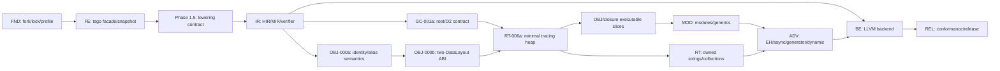

# ts2bin 可执行实施 Backlog

本文把六阶段路线图转换为可直接创建 issue 的工作分解。编号一旦进入实现就保持稳定；拆分子任务时追加后缀，例如 `FE-003a`，不要复用已关闭编号。2026-08-05 方向审计新增的 Phase 1.5 契约 issue 必须先于任何 IR 扩展实现。

issue 从提出到发布的状态、变更分级、审计入口和记录模板统一遵守 [compiler-development-process.md](compiler-development-process.md)。本文件回答“做什么、依赖谁”，流程文档回答“按什么步骤做、何时必须停下来审计”。

## 1. Issue 完成契约

每个 issue 至少包含：

- 关联的 TypeScript 支持矩阵行、handbook 章节和 AST Kind group。
- 输入 schema、输出 artifact、BINGO 诊断 code、runtime capability 和 ABI/schema 版本影响。
- 正例、拒绝例、snapshot/HIR/MIR golden；产生目标代码时再增加 LLVM verifier 和运行结果。
- 明确验收命令。命令尚未实现时由该 issue 同时补齐，不能只写“手工验证”。
- 上游 tsgo 行为、Bingo 静态规则和 dynamic/FFI 边界有冲突时，记录决策而不是隐式兼容。

统一完成定义：测试通过、无未分类 AST Kind、无 checker 指针越过 snapshot 边界、verifier 通过、capability 闭包完整、文档和 manifest 同步。

状态必须使用以下含义，禁止用“代码已写”代替验收完成：

| 状态 | 含义 |
| --- | --- |
| `implemented` | 主要生产代码已经存在，至少有定向正例；不代表阶段门禁已通过 |
| `prototype` | 只证明受限 happy path，schema、依赖边界或负例仍不完整 |
| `acceptance-blocked` | 实现已存在，但指定 regression、独立进程/clean clone、生产集成或负例证据仍失败/未运行 |
| `review-blocked` | 本地实现与证据已闭合，但流程要求的独立 A3/A4 审计尚未完成 |
| `owner-deferred` | 项目负责人明确延期的工程门禁；不得被解释为已通过，也不得用于 Integrated/Release 状态 |
| `ready` | 所有前置门禁已关闭，可以开始实现，但本 issue/阶段尚未达到退出条件 |
| `complete` | issue 的正例、拒绝例、独立边界、全套验收命令和交付 provenance 全部通过 |

## 2. 依赖主链



LLVM backend 可以较早用 primitive MIR 做纵向验证，但发布路径必须等 runtime ABI、异常/清理和 capability 闭包稳定后再冻结。

## 3. Foundation 与前端

| ID | 结果 | 依赖 | 主要验收 |
| --- | --- | --- | --- |
| `FND-001` | 建立薄 fork、`cmd/ts2bin` 和 `ts2bin.lock.json` | 无 | tsgo 上游测试通过；锁文件打印 commit/Go/stdlib/LLVM 版本 |
| `FND-002` | 规范化 `bingoOptions`、static/dynamic/interop profile | FND-001 | 配置 digest 稳定；不兼容选项有配置诊断 |
| `FND-003` | 建立诊断 code registry 与稳定排序 | FND-001 | TS/BINGO/BINGO-UNSAFE/LLVM 分类 golden |
| `FND-004` | 建立可获取的 ts2bin pinned-fork 交付与 clean-clone 门禁 | FND-001 | `.gitmodules`/lock/gitlink 固定 `pqcqaq/typescript-go` fork commit及 reviewed upstream ancestor；doctor 验证 remote/clean worktree/ancestry/closure；remote fork fetch 后通过测试/vet |
| `FE-001` | 封装 tsconfig -> CompilerHost -> Program 构造链 | FND-001 | `ts2bin check` 与 tsgo 诊断一致 |
| `FE-002` | 实现 checker 独占借用 helper 与 panic-safe release | FE-001 | 并发/提前返回测试无死锁；race test 通过 |
| `FE-003` | 定义并生成 `ProgramSnapshot`/稳定 ID | FE-002 | snapshot 无 AST/checker/type 指针；重复构建字节一致 |
| `FE-004` | 捕获 Type/Signature/Symbol/overload/narrowing facts | FE-003 | handbook 类型系统 fixture 的 semantic digest 稳定 |
| `FE-005` | 生成 AST Kind support manifest 与 subset gate | FE-003, FND-003 | 所有 source Kind 均为 S0/S1/S2/C/P/R 且有 handler/test |
| `FE-006` | 使用 Program resolution 生成 ModuleGraph | FE-003 | ESM/CJS/Node resolution、canonical path、循环依赖 golden |
| `FE-007` | 上游升级审计与 snapshot compatibility runner | FE-004, FE-005 | tsgo commit 变化会输出 Kind/API/stdlib/semantic diff |

阶段退出命令目标：

```text
go test ./internal/tsfrontend/...
ts2bin check testdata/ts2bin/syntax
ts2bin snapshot --verify-determinism testdata/ts2bin/frontend
ts2bin test --stage frontend
```

## 3.1 Phase 1.5：frontend-to-lowering contract

这些 issue 是进入 `IR-001` 的 P0 前置门禁；Phase 1 原有 `FE-001..007` 即使通过，也不能跳过本节。

| ID | 结果 | 依赖 | 主要验收 |
| --- | --- | --- | --- |
| `FE-008` | Snapshot schema v2、fail-closed capture 和完整性验证 | FE-003, FE-005 | tagged `SyntaxPayload`、具名 child roles、source blob、可解码 type payload；checker helper panic/error 不得降为空事实；reference/digest/parent-root/acyclic validation negative tests |
| `FE-009` | Property/signature/assertion/flow/capture/module semantic proof closure | FE-004, FE-006, FE-008 | read/write/optional/readonly/accessor/private、optional/rest/effects、assertion chain/representation、non-null proof kind、runtime free variables、specifier-level type-only edge golden |
| `FE-010` | AST/checker release 后的 snapshot-only first-slice replay 与 readiness hardening | FE-008, FE-009, FE-011 | 在稳定的 frontend/build-plan 边界上，`add(number, number)` 只消费序列化 snapshot 生成 canonical lowering events/verified HIR；fresh serialization/order determinism；未绑定 Kind、多 return、非 number、坏 symbol/type fail closed |
| `FE-011` | Platform identity、semantic-option closure、target split、profile merge 和 cache provenance | FE-008, FE-009 | case-sensitive path、Windows/WSL、完整 TS semantic options、target-independent frontend hash、CLI profile override 和 cache invalidation tests |
| `IR-000` | SourceTypePlan -> typed HIR -> specialization fixed point；BuildPlan -> ResolveTargetContext；二者经 RepresentationPlan -> MIR CFG/SSA -> verifier 的唯一 pass/effect DAG | FE-009, FE-010, FE-011 | 文档/实现/IR golden 使用同一顺序；循环实例化、effect 和 malformed pass 输入可验证 |

### 3.2 当前审计状态（2026-08-06）

| ID | 状态 | 已验证结果 / 剩余工作 |
| --- | --- | --- |
| `FND-004` | `complete` | 交付机制已迁移为 `pqcqaq/typescript-go` 固定 fork commit，旧 patch/materialize/apply 路径已退役；本地 doctor、frontend 九阶段、隔离 fork smoke/full test/vet、locked replay 双构建、远端 fork fetch/full test/vet 与 committed parent HEAD clean-clone 均已通过。 |
| `FE-008` | `complete` | schema v2、Kind-driven payload/role/arity、fail-closed graph/hash validation 和 overlay 负例均已进入 wire 单一 validator；`tsfrontend` 仅保留委托 API，核心/race/full regression 通过。 |
| `FE-009` | `complete` | property/signature/assertion/non-null/flow/capture、per-specifier bindings、effect closure、lowerer facts 和 ownership/redirect 负例已闭合；capture 只产出 proof，wire 独立重算并通过序列化 round-trip。 |
| `FE-010` | `complete` | checker-free `frontendwire`/`ast2bingo`/replay process、dependency closure、重复输出、显式 evaluation-order/single-block HIR 和 tamper post-verifier 已通过；compatibility/snapshot/options migration baseline 已审查并全绿。 |
| `FE-011` | `complete` | target-independent capture、semantic options、Windows/WSL identity、跨盘/UNC/POSIX rooted path fail-closed、profile/cache regression和 validated FrontendSnapshot binding 已通过；BuildPlan 已明确为 canonical unresolved request，默认 no-EH provenance 已迁移。 |
| `IR-000` | `complete` | canonical executor、specialization budget/fixed point、pre/post verifier、effect proof、deterministic replay/dump/golden，以及 validate-snapshot -> typed-HIR production prefix 已通过核心、race、frontend stage 与全仓 regression。typed HIR 之后的 TargetContext、生产 handlers 与真正 MIR verifier明确属于 Phase 2A。 |
| `FE-012a` | `complete` | capture-core validation/diagnostic sealing 已分层；subset gate 自行验证并使用 detached snapshot，production lowering 对重哈希 flags/modifiers/type-closure 篡改在三种 wrapper 路径全部 fail closed。 |
| `IR-007a` | `complete` | first-slice number contract v1 显式冻结 binary64、canonical qNaN、`-0`、RNE/no-fast-math `+`、固定 C ABI 与 bit observation；替代 policy 全部拒绝。 |
| `IR-001a/002a/003a` | `complete` | HIR major 2、CompilerBuildIdentity、identity-free source plan、logical requirements、number-only canonical HIR 与完整 malformed verifier matrix 已闭合；不同 driver identity 生成不同 HIR provenance/hash。 |
| Typed artifact envelope substrate | `complete` | role/schema/payload digest、canonical envelope、不可变 transition 和 typed read/write metadata 已实现；resolver 只读取 BuildPlan/runtime/toolchain manifests，HIR 保留到 RepresentationPlan join。 |
| `BE-001a` | `complete` | Go-LLVM wrapper 已锁定 Linux x86-64、LLVM 20.1.8、generic CPU 与 TargetMachine authoritative DataLayout；独立 module verifier 与重复 deterministic ELF object emission 通过。 |
| `RT-002a` | `complete` | Rust 1.97.1 workspace、版本化 ABI schema、empty startup、唯一 umbrella staticlib 与 runtime manifest 已落盘；Cargo test/fmt/clippy、Clang/LLD smoke 和隔离重复构建 byte identity 通过。 |
| `TC-001a` | `complete` | strict resolver 以真实 TargetMachine 交叉校验 BuildPlan/toolchain/runtime manifests，输出 immutable TargetContext、authoritative DataLayout 与非空 AvailableCapabilityCatalog；opaque HIR sidecar 原样保留，tamper/substitution 全部 fail closed。 |
| `RT-002b` | `complete` | ABI schema 固定程序导出 `extern "C" double add(double,double)`；严格 16 位 binary64 hex harness、harness object identity 和 runtime manifest/lock 已由重复 WSL 构建验证。 |
| `BE-002a` | `complete` | final verified bound MIR 真实降为 LLVM `fadd`/`nounwind`，通过 VerifyModule 与 deterministic ELF object emission；LLVM/object bytes 与全部 target/MIR provenance 进入 emission identity。 |
| `BE-004a` | `complete` | strict runtime inputs 经大小/SHA-256 复验后用 path-free deterministic response file 调用锁定 Clang/LLD；重复 link 的 response/map/executable identity 稳定，map 证明唯一 umbrella archive 与 ABI symbol，bit harness 已真实运行。 |
| `REL-001a`, `VERT-001` | `complete` | `test --stage static-core` 固定运行 checked-in first-slice manifest，在单 case timeout 内执行 snapshot-only HIR/MIR、LLVM/object/LLD/process；canonical report 绑定 compiler identity 与全部 artifact/output hashes。 |
| `REL-002a` | `complete` | runner 锁定 Node 22.22.0 与 oracle script hash；普通值、`-0`、canonical qNaN 三组结果在 expected/native executable/Node 三方一致，report schema 2 绑定 Node output hashes。 |

`FE-008a/009a/010a/011a/011b/012a`、`IR-000a/007a/001a/002a/003a/004a/005a/008a`、`FND-004a`、`BE-001a/002a/004a`、`RT-002a/002b`、`TC-001a`、`REL-001a`、`VERT-001` 与 `REL-002a` 的实现及交付验收均已关闭。Phase 2A 已退出；其后的 scoped Phase 2B primitive/static-core closure 状态见 4.2 节。

| 子任务 | 必须交付的关闭证据 |
| --- | --- |
| `FND-004a` | 已关闭：lock/gitlink/checkout 固定同一 fork commit，reviewed upstream 是其祖先，doctor 与远端 fork fetch/full test/vet 通过，包含正确 `.gitmodules`/lock/gitlink/scripts 的 committed parent HEAD clean clone 也确认身份、clean worktree 与 doctor。 |
| `FE-008a` | `frontendwire.ValidateProgramSnapshot` 成为 serialized validation 单一真源，`tsfrontend` 最终验证委托给它；原 overlay 反例必须作为 checked-in negative tests 通过，Kind/KindValue 漂移 fail closed。 |
| `FE-009a` | 保留已实现的 free/instance/static/constructor ownership/redirect negative tests；让 checker-time AST analyzer 只产出 proof，由 wire 单一 validator 独立重算 effect closure、module binding 与 lowerer required facts；禁止复制 serialized effect helpers。 |
| `FE-011a` | 对 source-level target independence、三项 TS options、validated FrontendSnapshot/BuildPlan binding、Windows/WSL path/profile/cache 运行全套 regression；跨盘符、UNC、POSIX rooted option/file/module/diagnostic path 在 wire 边界 fail closed。 |
| `FE-011b` | 增加 canonical no-EH first-slice mode，迁移 default options、lock、BuildPlan 与 golden；未实现的 `llvm-eh` 不得作为默认或已支持 provenance，status-code/native-unwind 后续分别锁定。 |
| `FE-010a` | 已有 dependency closure、新进程磁盘 replay、显式 primitive evaluation-order/single-block HIR 和重复输出证据；关闭 wire migration 后的 compatibility/snapshot/options full regression。 |
| `IR-000a` | canonical executor、specialization budget/fixed-point failure、pre/post verifier、independent effect proof、deterministic dump/golden 与 validate-snapshot -> typed-HIR production prefix 的定向及全量 regression 通过；后续 handler 集成属于 Phase 2A。 |

## 4. Bingo IR 与静态核心

| ID | 结果 | 依赖 | 主要验收 |
| --- | --- | --- | --- |
| `IR-001` | 在已冻结 HIR v2 基础上扩展完整 TsType/RepType/entity/origin schema | IR-000, FE-009, FE-010 | schema round-trip、版本拒绝、snapshot-only input 和 canonical hash 测试 |
| `IR-002` | HIR module/function/block/expression builder | IR-001, FE-005 | literal、变量、函数、if/loop/switch HIR golden |
| `IR-003` | HIR verifier 与 effect/unsafe provenance | IR-002 | 人工 malformed HIR 全部被拒绝 |
| `IR-004` | HIR -> MIR 的 CFG/SSA/phi/内存指令 lowering | IR-003 | 支配关系、phi、load/store、terminator golden |
| `IR-005` | MIR verifier 与 runtime intrinsic signature 检查 | IR-004 | malformed MIR 不进入 backend；capability 未绑定时失败 |
| `IR-006` | 可选链/nullish/逻辑赋值/解构等单次求值消糖 | IR-002 | getter/computed key/call 次数与 Node oracle 一致 |
| `IR-007` | primitive 表示、conversion、operator table | IR-004 | f64/NaN/-0、bool、null/undefined、UTF-16 fixture |
| `IR-008` | HIR/MIR 文本与二进制序列化、diff 工具 | IR-003, IR-005 | golden 可读、schema mismatch 明确、无地址噪声 |

### 4.1 Phase 2A first-slice 子任务

完整 `IR-001..007` 的验收包含变量、调用、general CFG、phi/memory、bool/null/string，不能作为 number-only 纵切的前置。Phase 2A 只关闭以下窄子任务；完整 issue 在 Phase 2B 及以后继续：

| ID | 依赖 | first-slice 关闭证据 |
| --- | --- | --- |
| `FE-012a` | FE-008a, FE-010a | 拆分 capture-core validation 与最终 diagnostic sealing；`RunSubsetGate` 只消费 validated snapshot/token 或自行 fail closed 验证，malformed snapshot 不能产生可被后续阶段信任的 subset 结果 |
| `IR-007a` | IR-000a | 在 RepType schema 前冻结 JavaScript `number = f64`、NaN payload policy、`-0`、`+` operator 和 C ABI bit-observation contract；不提前接受其他 primitive representation |
| `IR-001a` | IR-000a, IR-007a, FE-009a, FE-010a, FE-011b, FE-012a | 将已新增 mandatory provenance 的 pre-release HIR v1 协调升为 schema major 2，冻结只允许 number/void 的 TsType/RepType/entity/origin schema；同步 `HIRSchemaVersion`、replay、lock 与 IR-008 migration/rejection tests，并加入 upstream/fork/lowering `CompilerBuildIdentity`；bool/string/null/undefined fail closed |
| `IR-002a` | IR-001a | validated serialized snapshot 只生成参数读取、number 加法、单 block return 的 canonical HIR；artifact/op 显式携带 canonical logical capability requirements，纯 add 允许空 requirements |
| `IR-003a` | IR-002a | HIR verifier 拒绝篡改 schema、ID、type/effect/origin/terminator/compiler identity/logical capability、非 number op 和 unsupported CFG |
| `BE-001a` | IR-000a | 建立 Go-LLVM wrapper、锁定 Linux x86-64 TargetMachine/DataLayout，并让独立最小 module 通过 VerifyModule/object emission；不依赖完整 MIR |
| `RT-002a` | IR-000a | 建立 Cargo workspace、empty startup、最小 umbrella staticlib 和 toolchain/runtime manifest scaffold；不伪造尚未绑定的 MIR ABI/capability |
| `TC-001a` | FE-011b, BE-001a, RT-002a | resolver 只语义消费 canonical BuildPlan 与 toolchain/runtime manifests，用 typed input/output envelope（canonical bytes + digest，不是 fact 标签）绑定 immutable TargetContext + authoritative DataLayout + AvailableCapabilityCatalog，并不可变保留 HIR 供下一 pass join；首切只接受显式 Linux x86-64、LLVM 20、generic CPU、no-EH 和锁定 runtime，其余 fail closed；测试 non-empty available catalog 与后续 empty add bound closure 可并存 |
| `IR-004a` | `complete` | RepresentationPlan join pre-verifier 同时消费 verified HIR、BuildPlan 与 resolver envelope，核对 HIR FrontendSnapshotHash == BuildPlan.FrontendHash 及 context/request hashes 后，才降为 target-aware 单 block MIR；无 placeholder store/phi/call |
| `IR-005a` | `complete` | MIR artifact 固化 HIR/BuildPlan/CompilerBuildIdentity/TargetContext/DataLayout/catalog/logical requirement provenance；verifier 独立验证 first-slice dense IDs、RepType/DataLayout、return/effect/provenance/capability，并从 structural MIR 生成显式空 BoundCapabilityClosure；malformed MIR 不进入 backend |
| `IR-008a` | `complete` | first-slice HIR/MIR canonical JSON/text serialization、schema-aware diff、显式 case manifest 与 `emit-hir --verify` / `emit-mir --verify` CLI；只消费已验证 artifact，Windows/no-LLVM fail closed，Linux LLVM 20 真实 MIR 输出通过 |
| `RT-002b` | `complete` | 绑定 first-slice C ABI/artifact identity；生成函数固定为 `extern "C" double add(double,double)`，startup/harness 以 IEEE-754 bits 输入/输出，不含对象、GC 或 EH helper |
| `BE-002a` | `complete` | 只把 verified number-add MIR 降为 real LLVM，并通过 VerifyModule/object emission；不得直接消费未绑定 BuildPlan |

typed HIR 之后的 canonical pass handlers 与这些子任务同步实现。不适用的 pass 必须由 post-verifier 证明为 no-op，不能注册空 placeholder 后声称完整 DAG 已执行。

### 4.2 Phase 2B incremental closure

Phase 2B 继续按可执行纵切关闭，不能一次性把完整 `IR-001..008` 标为完成。第一条控制流纵切固定为 `choose(flag: boolean, left: number, right: number): number`，先证明 bool ABI 与基本 branch，再扩 local、direct call、loop、string/nullish 和单次求值语法。

| ID | 状态 | 依赖 | 关闭证据 |
| --- | --- | --- | --- |
| `IR-007b` | `complete` | IR-007a, VERT-001 | boolean contract 固定 canonical `i1` MIR 表示、C ABI `uint8_t` 且只接受 0/1、直接 i1 condition branch、禁止与 number 隐式互转；唯一 primitive representation mapping 与 alternative-contract negative tests 通过。 |
| `IR-001b/002b/003b` | `complete` | IR-007b, REL-002a | snapshot-only `choose` 已生成 boolean parameter 与三块 condbranch HIR；独立 Phase 2B verifier 证明 dense IDs、type、successor、reachability、dominance 和 return，旧 Phase 2A verifier 保持冻结；source/HIR/event 重哈希篡改全部拒绝。 |
| `IR-004b/005b + BE-002b` | `complete` | IR-001b/002b/003b | RepresentationPlan 已按 HIR 实际类型绑定 number/f64 与 boolean/i1；choose 生成三块 target-aware MIR，verifier 复验 CFG/类型/hash，LLVM 生成严格 i8 ABI 入口、i1 branch、trap 和 deterministic ELF object；malformed MIR 不到达 backend。 |
| `RT-002c + REL-001b/002b + VERT-002` | `complete` | IR-004b/005b, BE-002b | C ABI 以 `uint8_t` 传递 flag 并严格拒绝非 0/1；独立 choose harness、真实 ELF true/false、锁定 Node oracle、非 canonical byte 进程拒绝及全部 artifact/output provenance 已进入 canonical report。 |
| `IR-001c/002c/003c + BE-002c + REL-002c + VERT-003` | `complete` | VERT-002 | `calllocal` 真实 snapshot 生成 internal `add` 与 exported `compute`；SSA local bind/assign、签名绑定 direct call、多函数 HIR/MIR verifier、internal-linkage LLVM helper、独立 compute harness、真实 ELF 与 Node 22.22.0 differential 通过。 |
| `IR-001d/002d/003d/004d/005d + BE-002d + REL-002d + VERT-004` | `complete` | VERT-003 | `loop` 真实 snapshot 生成 `while`、`<`、header/body/exit CFG 与 loop-carried value；HIR v4/MIR v2 显式保存 incoming block，phi verifier 按入边验证定义支配并接受 back edge；LLVM 20 生成真实 phi、`fcmp olt`、back edge 和 exit，四组 binary64 输入与锁定 Node oracle 一致。 |

`IR-001e/002e/003e + IR-004e/005e + RT-002d + REL-001c/002d + VERT-005` 的 nullable-number coalesce 纵切已完成：HIR v5/MIR v3 固定 16-byte nullable ABI、distinct null/undefined tags、guarded unwrap、runtime harness、真实 LLVM/LLD/ELF 和 Node differential，并有 source/HIR/MIR/case/ABI negative tests。随后 VERT-006 关闭 local logical assignment；依赖 property place 的 optional-chain/logical-assignment 仍由 Phase 3 关闭。string ownership/GC 也仍需独立 representation/runtime contract。

`IR-006a + BE-002e + RT-002e + REL-002e + VERT-006` 的 local nullable coalesce-assignment 纵切已完成：真实 snapshot 固定 `value ??= fallback; return value`，HIR/MIR 复用 guarded nullable CFG 并记录 logical-assignment test/store 事件，LLVM/LLD/ELF 与独立 Node `??=` oracle 差分通过，rehashed return binding、malformed predicate/unwrap/phi、manifest/oracle substitution 和非法 ABI tag 均 fail closed。该子任务只证明局部变量 SSA writeback；完整 `IR-006` 的 property/computed-key/getter/call 单次求值证据依赖 Phase 3 `OBJ-000/001/003/006`，不得由本纵切提前关闭。

`IR-001f/002f/003f + IR-004f/005f + BE-002f + RT-002f + REL-002f + VERT-007` 的 `classify(value: number): number` 纵切已完成：HIR v6/MIR v4 冻结 lowercase binary64 literal bits、prefix unary `-` 和五块连续 if/多返回 CFG；MIR verifier 拒绝常量、`fneg`、比较或返回路径篡改；LLVM 20 使用 ordered `<`，保留 NaN 条件为 false 与 `-0` 分类为 `+0`；一参数 C ABI harness、real LLVM/LLD/ELF 和 Node differential 覆盖负数、`-0`、小数、`1` 与 qNaN。后续 UTF-16 工作已由 VERT-008 关闭；完整 property optional chain 仍属于 Phase 3 object/place contract。

`IR-001g/002g/003g + IR-004g/005g + BE-002g + RT-002g + REL-002g + VERT-008` 的 `stringLength(value: string): number` 纵切已完成：HIR v7/MIR v5 固定 16-byte borrowed immutable UTF-16 view、code-unit length 和 `string.length`/`utf16.length`；真实 ELF/Node differential 覆盖 ASCII、空串、孤立 surrogate、混合 surrogate 和 surrogate pair，非法 `{NULL, 1}` 在 ABI 入口 trap。该纵切不提供 owned storage、分配、拼接、索引或 GC。

`APP-001 + CLI-001 + VERT-009` 已完成 Phase 3 准入所需的实现、本地正/负例和 [self-audit 证据](phase2b-a3-self-audit-2026-08-11.md)：`ts2bin build` 可从真实 source project 生成 deterministic Linux x86-64 ELF 与相邻 canonical provenance report；HIR v8/MIR v6 独立验证唯一 exported parameterless `main(): number` 的 `0..255` literal exit status。该 D3 application preview 对 Integrated/release-profile consumption 仍为 `review-blocked`，因为独立 A3 review 未完成。自动 CI 为 `owner-deferred`，不改变 Phase 3 implementation-ready 结论，也不提供发布证据。

阶段退出命令目标：

```text
go test ./internal/bingo/...                 # IR-008a / IR core gate
ts2bin emit-hir --verify testdata/ts2bin/lowering # IR-008a
ts2bin emit-mir --verify testdata/ts2bin/lowering # IR-008a
ts2bin test --stage static-core               # REL-001a
```

### 4.3 Phase 2.5 engineering hardening

| ID | 状态 | 依赖 | 关闭证据 |
| --- | --- | --- | --- |
| `ENG-001` | `complete` | APP-001 | ELF/report 共用 staged atomic no-clobber publisher；并发 owner 不被覆盖；编码/发布失败回滚已生成 ELF，两个最终路径均不存在。 |
| `ENG-002` | `complete` | Phase 2B | primitive lowerer、MIR function-set verifier 与 LLVM emitter 使用显式 registry；ambiguous lowerer 被拒绝，重复 backend whitelist 已移除，lowerer registry source 纳入 compiler identity hash。 |
| `REL-003a` | `complete` | FE-008, IR-003/005 | `FrontendSnapshot`、`ProgramSnapshot`、Phase 2 HIR 和 structural MIR strict decoder 具有 256 KiB/1 MiB size-bound seed fuzz、canonical round-trip invariant，以及 HIR unknown/schema/hash 固定负例。 |
| `GOV-001` | `review-blocked` | APP-001 | 独立审计者完成 D3/A3 design + implementation review 后，application preview 才可进入 Integrated/release-profile consumption。 |
| Automatic CI | `owner-deferred` | project direction | 保持手动 workflow，不修改自动 trigger；重新启用前不允许声称 Integrated/ReleaseCandidate。 |

## 5. 布局、对象与方差

| ID | 结果 | 依赖 | 主要验收 |
| --- | --- | --- | --- |
| `OBJ-000a` | reference identity、aliasing、equality、readonly/write、escape 与 dynamic boundary 语义契约（`SelfAudited`） | IR-001, IR-000 | [设计/自审](phase3-obj-000a-design-2026-08-11.md)；versioned canonical contract、strict decoder/fuzz、mutable alias layout-proof gate 和语义正/负例通过；无物理布局/runtime ABI |
| `OBJ-000b + BE-004b` | versioned object header/shape/field/trace ABI，同时绑定 Linux x86-64 与 AArch64 compile-only DataLayout（`SelfAudited`） | OBJ-000a, BE-001 | [设计/自审](phase3-obj-000b-be-004b-design-2026-08-11.md)；Rust/C/LLVM size-align-offset 一致，schema/DataLayout/layout/offset/presence/trace substitution fail closed；无 allocation/GC |
| `GC-001a + BE-003b` | root liveness、safepoint、dead-slot、write barrier 与 O2 preservation contract（`SelfAudited`） | OBJ-000a, IR-005, RT-002 | [设计/自审](phase3-gc-001a-be-003b-design-2026-08-11.md)；canonical plan、独立 CFG/phi fixed-point、malformed root negative、LLVM O0/O2 双目标 proof |
| `RT-006a` | 支撑 owned object 的最小非移动 tracing heap（`SelfAudited`） | OBJ-000b, GC-001a, RT-002 | [设计/自审](phase3-rt-006a-design-2026-08-11.md)；cycle/root stress、malformed ABI/frame negative、release archive/manifest determinism；无 weak/finalization/async frame |
| `OBJ-001a + OBJ-006a + BE-003a + VERT-010` | object literal、静态 property read/write、identity/alias 纵切（`SelfAudited`） | RT-006a, OBJ-000b | [设计/自审](phase3-vert-010-design-2026-08-11.md)；canonical source-to-ELF、Node differential、可重算 semantic contract、完整 source/HIR/MIR/GC/backend negatives、fuzz 与 deterministic report 均通过 |
| `IR-006b + OBJ-003a/006b + VERT-011` | computed key、getter、optional chain、property logical assignment PlaceRef（`SelfAudited`） | VERT-010 | [设计/自审](phase3-vert-011-design-2026-08-11.md)；canonical source-to-ELF、Node side-effect differential、CLI 原子制品发布、unified runner、完整负例、fuzz 与 deterministic runtime/report 证据通过 |
| `OBJ-002a + BE-003a + VERT-012` | 首个 escaping mutable capture、FuncRef 与 indirect call 纵切（`SelfAudited`）；lexical `this`、递归、嵌套环境和 signature adaptation 后续独立闭合 | RT-006a, VERT-010 | [设计/自审](phase3-vert-012-design-2026-08-11.md)；canonical closure contract、snapshot/HIR v11/MIR v9、by-cell GC layout/root lifetime、LLVM/ELF/Node、manifest harness、CLI、runner、fuzz 与 deterministic evidence 通过 |
| `OBJ-003b + BE-003a + VERT-013a` | base class nominal identity、constructor receiver、instance field initialization 与 receiver-bound method（`SelfAudited`）；extends/super/private/static 后续独立纵切 | OBJ-001a, OBJ-002a, OBJ-003a | [设计/自审](phase3-vert-013a-design-2026-08-11.md)；contract/HIR/MIR/layout/GC binding、LLVM/ELF/Node、manifest harness、CLI、runner、fuzz、race 与 deterministic evidence 通过 |
| `OBJ-003b + BE-003a + VERT-013b` | 一个 statically-dispatched derived class、direct `super()`、base-prefix/derived-suffix layout（`SelfAudited`）；private/protected/static 与 variance/adapters 后续独立纵切 | VERT-013a | [设计](phase3-vert-013b-design-2026-08-12.md)；snapshot→contract v2→HIR v13→layout→MIR v11/bound MIR→TargetContext→LLVM/ELF/Node→runtime/runner/CLI 全链本地闭合；CI owner-deferred |
| `OBJ-003b` private/protected access | 声明类 private nominal identity 与 protected lexical/receiver access（`Implementing`）；不含 `#private`、static、variance、cast 或 adapter | VERT-013b | [设计](phase3-obj-003b-access-design-2026-08-12.md)；canonical access/execution contracts、checker-free replay v2、HIR v15、structural MIR v13、post-layout bound MIR、TargetContext/layout/backend plan、LLVM emitter、runtime harness/runner/CLI 和 decoders/fuzz 已实现；仍待 authoritative Linux runtime rebuild、locked manifest 更新、LLVM O0/O2、ELF 和 native/Node differential 实际证据 |
| `OBJ-004` | Bingo variance 分析与 ABI compatibility proof（`SelfAudited`） | OBJ-001a, OBJ-000b, FE-004 | per-declaration contract、checker-free interface replay、真实 nested-generic/SCC、cross-module type relation、object-layout equality 与 canonical HIR direct-reuse gate 已本地闭合；CI owner-deferred，见 [设计/自审](phase3-obj-004-variance-design-2026-08-12.md) |
| `OBJ-005` | checked cast、layout adapter、variance thunk（`Implementing`） | OBJ-004, IR-005 | readonly `ObjectViewProof`、真实 data/accessor snapshot replay、独立 HIR artifact、MIR v2 receiver/getter/ABI/effect binding、data/accessor backend plan、LLVM getter join、runtime harness 与 Node oracle 已实现；explicit layout copy adapter已闭合semantic/layout proof、真实static fixture的checker-free self-contained replay、additive HIR、allocation-root GC safety、target-dependent MIR、真实static TargetContext/catalog binding和strict backend plan；原子no-clobber `emit-object-layout-copy-replay` 与 strict production consumer 绑定current compiler identity、exact static BuildPlan frontend hash、observed TargetMachine和完整contract→HIR→MIR重推导；bound closure由GC事件重建为`alloc + frame.link/unlink + root.store/publish/reload`六项，LLVM20 emitter经TargetMachine接入并固定rooted allocation与f64 load/store，禁止identity preservation/accessor/optional/private/protected/reference-without-barrier/bitcast/redundant safepoint；`object_layout_copy_bits.c`真实GC分配/突变/identity harness、Node new-identity oracle及Linux tagged O0/ELF/native differential已加入但本机未执行，见[设计](phase3-obj-005-layout-copy-design-2026-08-12.md)；checked-cast replay v4 内嵌 canonical frontend snapshot并由 decoder checker-free 重算 evidence/boundary/semantic/layout/cast，真实 ambient `unknown` matching/missing fixture、原子 no-clobber `emit-checked-cast-replay` artifact boundary（正式用户边界，不另造 TypeScript cast syntax）、strict `Lower/ExecuteCheckedObjectCastReplay` artifact consumer（current compiler identity + BuildPlan hash join）、interop BuildPlan→TargetContext→catalog→binding→backend production pipeline 与 static/runtime-profile fail-closed gate、shape-match runtime ABI 与 strict tamper/fuzz 已实现；FunctionThunk v1 semantic/frontend replay/additive HIR/target-dependent MIR/backend plan/LLVM20 Linux emitter、no-clobber `emit-function-thunk-replay` 与 strict production consumer 已绑定 exact declarations、Dog→Animal relation、current compiler/static BuildPlan、target/DataLayout、object `gc-ref`、`{code-ptr,gc-ref-or-null}` FuncRef ABI，并实现 parameter identity→source indirect call→return identity；Linux O0/O2、ELF、C harness、environment/object identity、production target join 与 Node differential 测试已加入，但当前 Windows host 无法访问 WSL，故 native 证据仍待实际执行；权威 interop runtime manifest rebuild、positive checked-cast binding/native evidence仍待完成，见[checked-cast设计](phase3-obj-005-checked-cast-design-2026-08-12.md)与[FunctionThunk设计](phase3-obj-005-function-thunk-design-2026-08-12.md)； |
| `OBJ-006` | 已知 shape property/index access 与 dynamic boundary 完整闭合（`Implementing`） | VERT-011, OBJ-000a | admission/真实 interop replay/additive HIR 已冻结；DynamicValue ABI v1固定16-byte `{tag:u32,reserved:u32,payload:u64}`、opaque host handle/number bits/UTF-16 key、status `0/6`与exception-result contract；authenticated host registry、Rust property-load worker、generated C/Rust ABI、canonical replay CLI和host-number record registration ABI已实现，production replay→HIR→target MIR→authoritative resolve/bind 与严格 backend plan/LLVM20 wrapper已接通；`emit-property-access-unbound` 只发布 replay/HIR/unbound MIR/strict report 的deterministic no-clobber bundle，明确不发布bound/backend/LLVM/object；runtime build chain 现支持 static 基线与独立 interop overlay，Linux build 会在 dynamic C smoke 成功后分别生成两个 profile manifest，overlay capability 按 logical name 唯一排序并进入 profile-specific target identity；Go runtime-manifest/catalog validator共用profile-specific capability closure，interop严格要求唯一dynamic capability的symbol/signature/`call,read,throw` effects和排序，结构正确候选仍在最终authoritative identity gate fail closed；Go test按Python writer算法从真实baseline+overlay重算interop target hash，锁住producer/consumer跨语言一致性；TargetContext 现显式接纳 static/interop 契约但按 profile 锁定独立 authoritative manifest identity，当前仅发布 static identity，故 interop plan 配 static manifest 在 capability binding 前 fail closed；locked catalog负例证明 capability不能偷渡，C smoke已为Linux authoritative rebuild接入，但 authoritative interop manifest identity、positive binding和Linux object/native harness仍待完成 |

## 6. 模块、泛型和核心 Runtime

| ID | 结果 | 依赖 | 主要验收 |
| --- | --- | --- | --- |
| `MOD-001` | 模块导出槽、两阶段初始化和循环依赖 | FE-006, OBJ-001a | 重复导入一次执行；循环读取行为固定 |
| `MOD-002` | 按表示分组的泛型单态化与预算 | OBJ-004, IR-005 | MIR 无 unresolved type parameter；超限诊断可定位 |
| `MOD-003` | import/export type 擦除与 ambient/FFI contract | MOD-001 | `.d.ts` 无函数体不生成代码；未绑定 extern 编译失败 |
| `RT-001` | 从 `lib.es*.d.ts` 生成 stdlib/capability candidate | FE-007 | 81 分项、314 类型、2173 成员全部进入 manifest |
| `RT-002` | Rust workspace、`bingo-abi` schema、native staticlib 与 runtime registry | RT-001, IR-005 | 空 runtime/startup 跨语言 smoke link；`repr(C)`/symbol/layout 双向 diff；缺 capability 编译失败 |
| `RT-003a` | owned UTF-16 string、array/tuple 与 readonly view | RT-006a, OBJ-001a | allocation/root/UTF-16/bounds conformance；不得回退为泄漏式测试 heap |
| `RT-003b` | Map/Set 基础 runtime | RT-003a, OBJ-004 | SameValueZero、插入顺序、迭代和边界 conformance |
| `RT-004a` | 同步 iterator、spread、for-of 与 IteratorClose | RT-003a | normal/break/continue/return 路径恰好 close 一次 |
| `RT-004b` | throwing IteratorClose | RT-004a, ADV-001, BE-003c | throw/finally/return precedence 与跨目标运行测试 |
| `RT-005a` | 同步 cleanup stack 与 Disposable ABI | RT-002, IR-005 | normal/break/continue/return 的 using cleanup 恰好一次 |
| `RT-005b` | throwing cleanup | RT-005a, ADV-001, BE-003c | throw/finally/rethrow cleanup precedence |
| `RT-005c` | AsyncDisposable / await using | RT-005b, ADV-002 | suspend/reject/cancel 路径 cleanup 恰好一次 |
| `GC-001`, `RT-006` | 在 Phase 3 最小 heap 上扩展完整 tracing GC | RT-006a, OBJ-002a | async frame、压力预算、unsafe/Miri/sanitizer、弱引用前置测试 |
| `RT-007a` | 无分配/无抛出/无挂起的 self-hosted TypeScript stdlib seed HIR/package | MOD-002, IR-005 | package format 不依赖 owned runtime；specialization 稳定并可 dead-strip |
| `RT-007b` | 可发布 self-hosted core stdlib package | RT-007a, RT-006, ADV-001 | owned storage、分配、异常与 cleanup effect 全部进入 verifier/capability 闭包；Node/Test262 differential 通过 |

## 7. 高级 Runtime 与动态边界

| ID | 结果 | 依赖 | 主要验收 |
| --- | --- | --- | --- |
| `EH-001` | Rust status/exception-carrier ABI 与 native unwind bridge contract | RT-002, IR-005 | status-to-throw shim、carrier ownership/rethrow、panic isolation、Itanium/Windows probe 和 link contract |
| `ADV-001 + BE-003c` | LLVM EH/runtime EH 契约与 try/catch/finally | EH-001, RT-005a, RT-006a | invoke/unwind、finally、cleanup 的跨目标测试；同时解锁 RT-004b/005b |
| `ADV-002` | Rust Promise/microtask 原语与 async/await 状态机 | ADV-001, RT-006, RT-007a | fulfillment/rejection/thenable/suspend root 测试；panic 不穿越 ABI |
| `ADV-003` | generator/async iterator/for-await 状态机 | ADV-002, RT-004b | next/return/throw、yield*、close 协议测试 |
| `ADV-004` | BigInt/RegExp/Symbol/TypedArray Rust runtime 模块 | RT-002, RT-006 | 独立 crate/archive/capability 逐项开启，engine/version/license 和 ES fixture 通过 |
| `ADV-005` | 标准/legacy decorator 两条独立 lowering | OBJ-003b, ADV-001 | 执行顺序、initializer、metadata profile 测试 |
| `ADV-006` | JSX runtime contract | MOD-003, OBJ-002a | factory/fragment/import source 和 children 求值顺序 |
| `ADV-007` | DynamicValue、host FFI 和 checked interop | OBJ-006, ADV-001 | 每个边界可审计；static 未触达代码不受影响 |
| `ADV-008` | ES2025/ESNext/Temporal/Intl capability 扩展 | RT-002, ADV-002 | experimental profile、数据版本和外部 ABI 固定 |

## 8. LLVM、测试与发布

| ID | 结果 | 依赖 | 主要验收 |
| --- | --- | --- | --- |
| `BE-001` | `tinygo.org/x/go-llvm`/LLVM 20 环境、TargetMachine/DataLayout 与 wrapper | FND-004 | `ts2bin doctor`、最小 module、VerifyModule 和 object smoke 通过；不依赖完整 MIR |
| `BE-002` | primitive/CFG/call/global/source metadata lowering | BE-001, IR-007 | LLVM golden、llvm-as/opt/llc 通过 |
| `BE-004a` | primitive target/object/linker probe for the first vertical slice | BE-001a, BE-002a, RT-002b | 用固定 harness object + runtime archive 验证 Linux x86-64 object、确定性 LLD response file 和 C ABI link/run smoke；不冒充完整 snapshot-to-process runner |
| `BE-003a` | object/closure lowering | BE-002, OBJ-000b | 随 VERT-010/012 关闭 layout、field、FuncRef、environment 的 link/run 测试 |
| `BE-003b` | GC root/safepoint/barrier lowering | BE-002, GC-001a | O2 前后 root/barrier litmus 与运行压力测试 |
| `BE-003c` | status/exception/invoke/unwind lowering | BE-002, EH-001 | 与 ADV-001 同纵切关闭跨目标 exception/cleanup ABI |
| `BE-004b` | Phase 3 compile-only second authoritative DataLayout | BE-001, OBJ-000a | object ABI 在两个 DataLayout 上 size-align-offset 一致且 hash 独立 |
| `BE-004` | 完整第二运行目标、archive 选择和 linker 产品化 | BE-003a/b/c, RT-002 | deterministic response；Linux + 第二目标运行；错误 target/ABI 有 doctor 诊断 |
| `BE-005` | snapshot/HIR/MIR/LLVM 增量 cache | FE-007, IR-008, BE-002 | provenance key 包含 upstream commit、fork commit、lowering schema/compiler build identity、TargetContext 与 runtime/ABI/layout hashes；缺字段只能 cache miss |
| `REL-001a` | first-slice case-runner core | FE-005, FE-010a, IR-005a, IR-008a, BE-004a | 单个 `add` case 可隔离、超时、乱序执行并记录 snapshot/HIR/MIR/LLVM/object/executable/output provenance；拥有 `test --stage static-core` 阶段门禁；无需先完成全 handbook release coverage |
| `REL-001b` | incremental vertical-slice runner growth | REL-001a | VERT-002 起每个新语义纵切同时增加 precise diagnostic/artifact/oracle contract，不等待完整 BE-004 或 Phase 6 |
| `VERT-001` | Linux x86-64 real-LLVM executable vertical slice (`add(number, number)`) | FND-004a, FE-008a, FE-009a, FE-010a, FE-011a, FE-011b, FE-012a, IR-000a, TC-001a, IR-005a, RT-002b, BE-004a, REL-001a | case runner 执行 validated serialized snapshot-only lowering -> HIR verifier -> resolver/RepresentationPlan join -> MIR verifier -> real LLVM -> object -> LLD -> run；由固定 C ABI harness 输出 IEEE-754 bits，不含对象、GC、EH、字符串 |
| `REL-002a` | `[complete]` First-slice Node oracle differential harness | VERT-001, REL-001a | `add` source/snapshot/HIR/MIR/output manifest 与锁定 Node oracle 差分通过；capture/replay 不依赖 AST/checker |
| `REL-001` | 完整 case manifest runner、精确 diagnostic/artifact/oracle 执行与 handbook/AST 覆盖报告 | REL-001b, IR-008, BE-004 | case 可独立/乱序/超时执行；code/stage/span/profile/multiplicity/capability 精确比较；17 章和所有矩阵 R 规则可追溯 |
| `REL-002` | Node/TypeScript/规范 differential runner | BE-004, ADV-004, REL-002a | static subset 可观察结果一致 |
| `REL-003` | 持续 parser/lowering/differential/cleanup fuzz 与隔离执行 | REL-003a, IR-005, RT-005b | corpus/seed/timeout 可复现，非法 IR 不进入 LLVM，cleanup 恰好一次 |
| `REL-004` | Go/Rust/LLVM CI 矩阵、性能预算和可复现构建 | BE-005, REL-001, REL-002 | clean build 的 Rust archive、manifest 和最终 artifact digest 稳定 |
| `REL-005` | profile 发布清单、许可证、ABI/schema 迁移说明 | REL-004 | 只发布通过 conformance 的 profile |

## 9. 第一条纵向实现路径

首个里程碑是一个明确受限的 Linux x86-64 `add(number, number): number`，并且必须从序列化 snapshot 开始：

1. `[complete] FE-008a/009a/010a/011a/011b`、`IR-000a`：lowering-complete snapshot、语义 proof、snapshot-only replay、truthful target/profile provenance 和唯一 pass contract 已冻结。
2. `[complete] FND-004a`：`pqcqaq/typescript-go` fork remote、fork commit、reviewed upstream ancestor、parent gitlink/lock 和 fork verification/merge scripts 已落盘；本地 doctor、frontend/全仓回归、隔离 fork test/vet、replay 双构建、远端 fork fetch/full test/vet 和 committed parent HEAD clean-clone 均已通过。旧 patch/materialize/apply 机制不再是交付路径。
3. `[complete] FE-012a, IR-007a/001a/002a/003a, BE-001a, RT-002a`：validated-input、number contract、HIR v2/compiler identity/logical requirements、number-only verifier、TargetMachine/DataLayout 与 Rust workspace/startup/manifests 已冻结并通过真实工具链验证。
4. `[complete] BE-001a + RT-002a + BuildPlan -> TC-001a -> IR-004a/005a -> IR-008a -> RT-002b + BE-002a/004a`：resolver 只解析请求/manifests；RepresentationPlan 已首次 join verified HIR/BuildPlan/TargetContext；number-only target-aware MIR、固定 C ABI bit harness、真实 LLVM verifier/object emission、确定性 LLD link map 与 C ABI run smoke 均已由 LLVM 20 pipeline 复核。
5. `[complete] REL-001a`：统一 runner 在单 case timeout 内执行 first-slice manifest，拥有 `test --stage static-core`，并精确记录 snapshot/HIR/MIR/LLVM/object/response/map/executable/output provenance；完整 handbook/diagnostic runner留给 `REL-001`。
6. `[complete] VERT-001 + REL-002a` 已由统一 runner 执行 Linux `add` 可执行纵切，并与锁定 Node oracle 完成普通值、`-0`、canonical qNaN 差分；Phase 2A 已退出。

此纵切明确延后对象、字符串、GC、EH、async、模块、dynamic、Proxy、WeakRef/finalization、self-hosted stdlib、ARC/arena、`no_std`、Windows native EH、statepoint/LTO 和第二目标；它先验证最容易返工的前端快照、IR、LLVM、链接和可复现执行边界。

## 10. 变更控制

- Snapshot、HIR/MIR schema、runtime ABI 和 capability manifest 分别版本化；不允许用一个“项目版本”掩盖不兼容变化。
- 改 support level、unsafe 规则、GC/异常模型、对象布局或 FFI ABI 时必须写设计记录，并附迁移/缓存失效说明。
- tsgo 升级独立于功能开发：先跑 `FE-007` 分类差异，再允许更新 lock；禁止在同一变更中混入大面积 lowering 重写。
- 每个阶段只在其退出门禁全部通过后标记 complete；“样例能运行”不能替代 verifier、拒绝例和 capability 覆盖。
