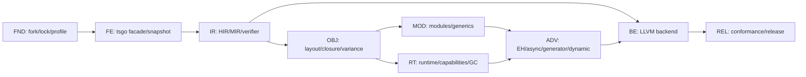

# ts2bin 可执行实施 Backlog

本文把六阶段路线图转换为可直接创建 issue 的工作分解。编号一旦进入实现就保持稳定；拆分子任务时追加后缀，例如 `FE-003a`，不要复用已关闭编号。

issue 从提出到发布的状态、变更分级、审计入口和记录模板统一遵守 [compiler-development-process.md](compiler-development-process.md)。本文件回答“做什么、依赖谁”，流程文档回答“按什么步骤做、何时必须停下来审计”。

## 1. Issue 完成契约

每个 issue 至少包含：

- 关联的 TypeScript 支持矩阵行、handbook 章节和 AST Kind group。
- 输入 schema、输出 artifact、BINGO 诊断 code、runtime capability 和 ABI/schema 版本影响。
- 正例、拒绝例、snapshot/HIR/MIR golden；产生目标代码时再增加 LLVM verifier 和运行结果。
- 明确验收命令。命令尚未实现时由该 issue 同时补齐，不能只写“手工验证”。
- 上游 tsgo 行为、Bingo 静态规则和 dynamic/FFI 边界有冲突时，记录决策而不是隐式兼容。

统一完成定义：测试通过、无未分类 AST Kind、无 checker 指针越过 snapshot 边界、verifier 通过、capability 闭包完整、文档和 manifest 同步。

## 2. 依赖主链



LLVM backend 可以较早用 primitive MIR 做纵向验证，但发布路径必须等 runtime ABI、异常/清理和 capability 闭包稳定后再冻结。

## 3. Foundation 与前端

| ID | 结果 | 依赖 | 主要验收 |
| --- | --- | --- | --- |
| `FND-001` | 建立薄 fork、`cmd/ts2bin` 和 `ts2bin.lock.json` | 无 | tsgo 上游测试通过；锁文件打印 commit/Go/stdlib/LLVM 版本 |
| `FND-002` | 规范化 `bingoOptions`、static/dynamic/interop profile | FND-001 | 配置 digest 稳定；不兼容选项有配置诊断 |
| `FND-003` | 建立诊断 code registry 与稳定排序 | FND-001 | TS/BINGO/BINGO-UNSAFE/LLVM 分类 golden |
| `FE-001` | 封装 tsconfig -> CompilerHost -> Program 构造链 | FND-001 | `ts2bin check` 与 tsgo 诊断一致 |
| `FE-002` | 实现 checker 独占借用 helper 与 panic-safe release | FE-001 | 并发/提前返回测试无死锁；race test 通过 |
| `FE-003` | 定义并生成 `ProgramSnapshot`/稳定 ID | FE-002 | snapshot 无 AST/checker/type 指针；重复构建字节一致 |
| `FE-004` | 捕获 Type/Signature/Symbol/overload/narrowing facts | FE-003 | handbook 类型系统 fixture 的 semantic digest 稳定 |
| `FE-005` | 生成 AST Kind support manifest 与 subset gate | FE-003, FND-003 | 所有 source Kind 均为 S0/S1/S2/C/P/R 且有 handler/test |
| `FE-006` | 使用 Program resolution 生成 ModuleGraph | FE-003 | ESM/CJS/Node resolution、canonical path、循环依赖 golden |
| `FE-007` | 上游升级审计与 snapshot compatibility runner | FE-004, FE-005 | tsgo commit 变化会输出 Kind/API/stdlib/semantic diff |

阶段退出命令目标：

```text
go test ./internal/tsfrontend/...
ts2bin check testdata/ts2bin/syntax
ts2bin snapshot --verify-determinism testdata/ts2bin/frontend
ts2bin test --stage frontend
```

## 4. Bingo IR 与静态核心

| ID | 结果 | 依赖 | 主要验收 |
| --- | --- | --- | --- |
| `IR-001` | 固定 TsType/RepType/entity/origin schema v1 | FE-004 | schema round-trip、版本拒绝和 canonical hash 测试 |
| `IR-002` | HIR module/function/block/expression builder | IR-001, FE-005 | literal、变量、函数、if/loop/switch HIR golden |
| `IR-003` | HIR verifier 与 effect/unsafe provenance | IR-002 | 人工 malformed HIR 全部被拒绝 |
| `IR-004` | HIR -> MIR 的 CFG/SSA/phi/内存指令 lowering | IR-003 | 支配关系、phi、load/store、terminator golden |
| `IR-005` | MIR verifier 与 runtime intrinsic signature 检查 | IR-004 | malformed MIR 不进入 backend；capability 未绑定时失败 |
| `IR-006` | 可选链/nullish/逻辑赋值/解构等单次求值消糖 | IR-002 | getter/computed key/call 次数与 Node oracle 一致 |
| `IR-007` | primitive 表示、conversion、operator table | IR-004 | f64/NaN/-0、bool、null/undefined、UTF-16 fixture |
| `IR-008` | HIR/MIR 文本与二进制序列化、diff 工具 | IR-003, IR-005 | golden 可读、schema mismatch 明确、无地址噪声 |

阶段退出命令目标：

```text
go test ./internal/bingo/...
ts2bin emit-hir --verify testdata/ts2bin/lowering
ts2bin emit-mir --verify testdata/ts2bin/lowering
ts2bin test --stage static-core
```

## 5. 布局、对象与方差

| ID | 结果 | 依赖 | 主要验收 |
| --- | --- | --- | --- |
| `OBJ-001` | object/class/tuple/array layout descriptor | IR-007 | 字段 offset、alignment、nullable 和 shape hash 稳定 |
| `OBJ-002` | FuncRef、闭包环境、lexical `this`、间接调用 | OBJ-001 | 捕获、递归、escaping closure 和签名不匹配测试 |
| `OBJ-003` | class extends/super/private/accessor/static init | OBJ-001, OBJ-002 | 初始化顺序、private identity、getter effect fixture |
| `OBJ-004` | Bingo variance 分析与 ABI compatibility proof | OBJ-001, FE-004 | 返回协变、参数逆变、可写字段/数组不变 |
| `OBJ-005` | checked cast、layout adapter、variance thunk | OBJ-004, IR-005 | adapter 保留调用语义；disjoint/`as any as` 默认拒绝 |
| `OBJ-006` | 已知 shape property/index access 与 dynamic boundary | OBJ-001 | 静态 key 直达；未知 key 产生 R 或显式 DynamicBoundary |

## 6. 模块、泛型和核心 Runtime

| ID | 结果 | 依赖 | 主要验收 |
| --- | --- | --- | --- |
| `MOD-001` | 模块导出槽、两阶段初始化和循环依赖 | FE-006, OBJ-001 | 重复导入一次执行；循环读取行为固定 |
| `MOD-002` | 按表示分组的泛型单态化与预算 | OBJ-004, IR-005 | MIR 无 unresolved type parameter；超限诊断可定位 |
| `MOD-003` | import/export type 擦除与 ambient/FFI contract | MOD-001 | `.d.ts` 无函数体不生成代码；未绑定 extern 编译失败 |
| `RT-001` | 从 `lib.es*.d.ts` 生成 stdlib/capability candidate | FE-007 | 81 分项、314 类型、2173 成员全部进入 manifest |
| `RT-002` | runtime ABI registry、symbol hash 和 linker 闭包 | RT-001, IR-005 | 声明/实现双向 diff；缺 capability 在编译期失败 |
| `RT-003` | UTF-16 string、array/tuple、Map/Set 基础 runtime | RT-002, OBJ-001 | UTF-16、SameValueZero、顺序和边界 conformance |
| `RT-004` | iterator、spread、for-of 和 IteratorClose | RT-003 | 正常/throw/break/return 都执行正确 close |
| `RT-005` | cleanup stack、Disposable/AsyncDisposable ABI | RT-002, IR-005 | using 的全部退出边恰好清理一次 |
| `RT-006` | 非移动 tracing GC v1 与 root/write barrier ABI | OBJ-001, RT-002 | 环、闭包、异步 frame、弱引用前置测试；ARC 受限拒绝 |

## 7. 高级 Runtime 与动态边界

| ID | 结果 | 依赖 | 主要验收 |
| --- | --- | --- | --- |
| `ADV-001` | LLVM EH/runtime EH 契约与 try/catch/finally | RT-005, RT-006 | invoke/unwind、finally、cleanup 的跨目标测试 |
| `ADV-002` | Promise/microtask 与 async/await 状态机 | ADV-001, RT-006 | fulfillment/rejection/thenable/suspend root 测试 |
| `ADV-003` | generator/async iterator/for-await 状态机 | ADV-002, RT-004 | next/return/throw、yield*、close 协议测试 |
| `ADV-004` | BigInt/RegExp/Symbol/TypedArray runtime 模块 | RT-002, RT-006 | capability 逐项开启，ES 行为 fixture 通过 |
| `ADV-005` | 标准/legacy decorator 两条独立 lowering | OBJ-003, ADV-001 | 执行顺序、initializer、metadata profile 测试 |
| `ADV-006` | JSX runtime contract | MOD-003, OBJ-002 | factory/fragment/import source 和 children 求值顺序 |
| `ADV-007` | DynamicValue、host FFI 和 checked interop | OBJ-006, ADV-001 | 每个边界可审计；static 未触达代码不受影响 |
| `ADV-008` | ES2025/ESNext/Temporal/Intl capability 扩展 | RT-002, ADV-002 | experimental profile、数据版本和外部 ABI 固定 |

## 8. LLVM、测试与发布

| ID | 结果 | 依赖 | 主要验收 |
| --- | --- | --- | --- |
| `BE-001` | `tinygo.org/x/go-llvm`/LLVM 20 环境与 wrapper | IR-005 | `ts2bin doctor`、最小 module、VerifyModule 通过 |
| `BE-002` | primitive/CFG/call/global/source metadata lowering | BE-001, IR-007 | LLVM golden、llvm-as/opt/llc 通过 |
| `BE-003` | object/closure/runtime/EH lowering | BE-002, OBJ-003, ADV-001 | ABI contract 与 runtime link/run 测试 |
| `BE-004` | TargetMachine、object、linker 和跨目标 data layout | BE-003 | x86-64 Linux + 第二目标运行；错误环境有 doctor 诊断 |
| `BE-005` | snapshot/HIR/MIR/LLVM 增量 cache | FE-007, IR-008, BE-002 | provenance key 完整；缺字段只能 cache miss |
| `REL-001` | case manifest runner 与 handbook/AST 覆盖报告 | FE-005, IR-008 | 17 章和所有矩阵 R 规则可追溯 |
| `REL-002` | Node/TypeScript/规范 differential runner | BE-004, ADV-004 | static subset 可观察结果一致 |
| `REL-003` | parser/lowering/cleanup fuzz 与隔离执行 | IR-005, RT-005 | timeout/崩溃可复现，非法 IR 不进入 LLVM |
| `REL-004` | CI 矩阵、性能预算和可复现构建 | BE-005, REL-001, REL-002 | clean build artifact digest 稳定 |
| `REL-005` | profile 发布清单、许可证、ABI/schema 迁移说明 | REL-004 | 只发布通过 conformance 的 profile |

## 9. 第一条纵向实现路径

首个里程碑只编译一个无对象、无异常的 `add(number, number): number`，但完整经过真实边界：

1. `FND-001`、`FND-002`、`FE-001`、`FE-002`：能够可靠构造 Program 并释放 checker。
2. `FE-003`、`FE-004`、`FE-005`：得到稳定 typed snapshot 和 subset 诊断。
3. `IR-001` 至 `IR-005`、`IR-007`：生成可验证 HIR/MIR，而不是从 AST 直发 LLVM。
4. `BE-001`、`BE-002`：生成 LLVM IR/object，并由 verifier 和 linker 验证。
5. `REL-001`、`REL-002`：用 case manifest 与 Node oracle 锁定结果。

这条纵切不提前承诺 class、GC 或标准库，但会先验证最容易返工的五个边界：tsgo 生命周期、snapshot 稳定性、IR schema、LLVM 绑定和差分测试。

## 10. 变更控制

- Snapshot、HIR/MIR schema、runtime ABI 和 capability manifest 分别版本化；不允许用一个“项目版本”掩盖不兼容变化。
- 改 support level、unsafe 规则、GC/异常模型、对象布局或 FFI ABI 时必须写设计记录，并附迁移/缓存失效说明。
- tsgo 升级独立于功能开发：先跑 `FE-007` 分类差异，再允许更新 lock；禁止在同一变更中混入大面积 lowering 重写。
- 每个阶段只在其退出门禁全部通过后标记 complete；“样例能运行”不能替代 verifier、拒绝例和 capability 覆盖。
